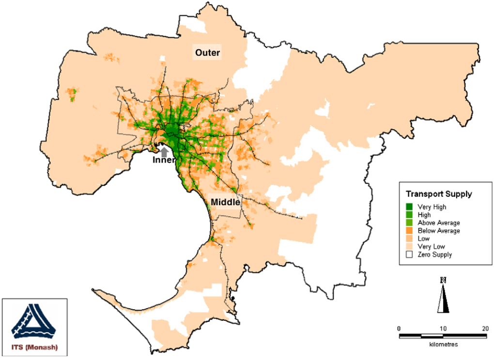
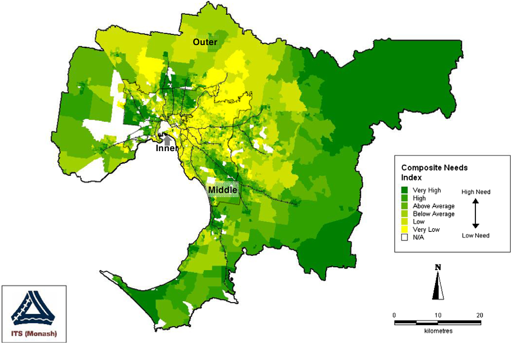
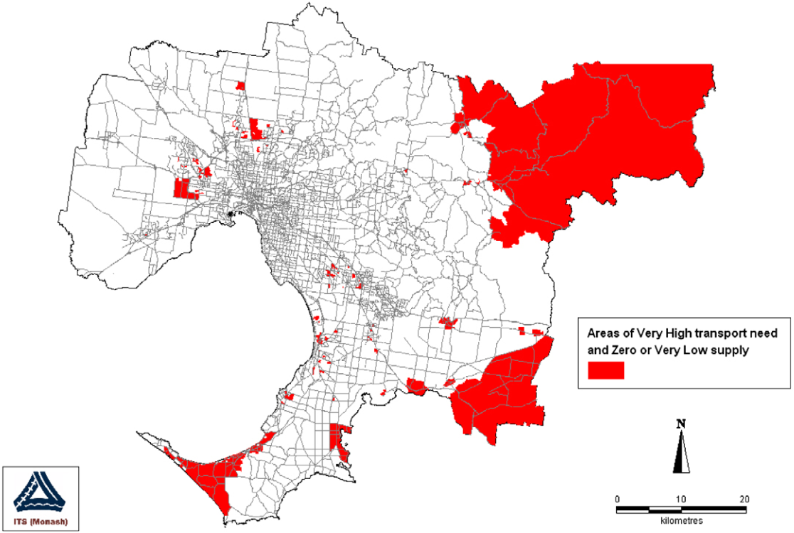
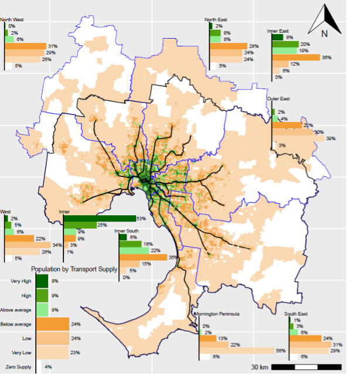

```{r setup, include=FALSE}
library(tidyverse)
library(tidytransit)
library(sp)
library(strayr)
library(ptinpoly)
library(magrittr)
library(ggplot2)
library(sf)
library(ASGS.foyer)
library(raster)
library(ggmap)
library(units)
library(janitor)
library(mapview)
library(ggstatsplot)
library(gtsummary)
library(moments)
library(scales)
library(gtfstools)
library(lubridate)
library(kableExtra)
library(knitr)
library(readxl)
library(readr)
library(dplyr)
library(devtools)
library(gtfssupplyindex)
library(readabs)
library(gglorenz)
library(DescTools)
library(RColorBrewer)
library(lsr)
library(ggpubr)
library(viridis)
library(geosphere)
library(png)
library(absmapsdata)
library(tidytransit)
library(patchwork)
library(ggmapinset)
library(tufte)
library(gglorenz)
library(ggExtra)
library(ggthemes)
library(geomtextpath)
library(ggrepel)

knitr::opts_chunk$set(warning = FALSE, message = FALSE) 

```

# Introduction
Currie et al[-@Currie2003Hobart; -@Currie2004Gap; -@Currie2007Identifying; @currie2010identifying] 
developed a methodology for assessing 
spatial gaps between social needs for transport 
and transit supply, suggesting this would be "substantially more useful than the presentation of anecdotal evidence, which is the most common means of identifying transport needs in local transport studies through the world" (Currie 2010). 
While Currie et al reported results for Adelaide, Melbourn and Hobart in Australia, this appoach does not appear to have been widely adopted 
or used in many other places to assess the extent to which public transport 
service provision is meeting communities' needs for transport. 

The CONUNDRUM project relates to sustainable transport,
community mobility 
and co-creation, and is using Enniscorthy 
in County Wexford, Ireland,
as a test bed. 
It does not appear that the Currie et al[-@Currie2003Hobart; -@Currie2004Gap; -@Currie2007Identifying; @currie2010identifying] 
methodology has been used in Ireland.  
This note, therefore, applies the Currie et al methodology to Enniscorthy and County Wexford, using a recently developed package of software tools^[See
https://github.com/James-Reynolds/gtfssupplyindex] that enable this analysis approach to be undertaken using General Transit Feed Specification (GTFS) data as an input. 
The next section of this note outlines the background, and describes the Transit Supply Index (SI) and categorisations, and Social Needs Index and categorisations 
developed by Currie et al.  The methodology used for this analysis is then described, followed by the presentation of results. These include mapping and other reporting of transit supply and scoial need for 


# Background

The Currie et al social needs-gap approach involves the calculation of three components for a particular area of interest: 

- A Transit Supply Index (SI), based on the frequency and coverage of public transport services; 
- A Social Needs Index, based on the combination of various indicators relating to the population living in each area of interest, and the disctance between the area of interest and the centre of major urban areas; 
- Categorising of each area of interest's SI and Social Needs Index scores based on city/county/state/district averages^[Transit supply categories: Zero Supply, three equal categories with lower than the average SI score (Very Low, Low and Below Average) and three equal categories with higher than the average SI score (Above Average, High and Very High). Social Needs Index scores are similarly categorised into six groups (excluding the zero category).] so that areas with Very High social needs for transit, but Zero or Very Low levels of transit supply can be identified.  

The SI score, Social Needs Index and other further details are described in the following. 

## Transit supply
Supply Index (SI) scores are
based on the 
number of transit service arrivals 
at stops in and around 
each area of interest. 
Adjustments are made 
for the amount of 
each area 
that is within 
a typical walking distance 
of each stop, 
according to the following 
formula: 

$$SI_{area, time} = \sum{\frac{Area_{Bn}}{Area_{area}}SL_{n, time}}$$

where:

-   $SI_{area, time}$ is the Supply Index for the area of interest and a given period of time;

-   $Area_{Bn}$ is the buffer area for each stop (n) within the area of interest^[In @currie2010identifying this was based on a radius of 400 metres for bus and tram stops, and 800 metres for railway stations. The same definition is used here.];

-   $Area_{area}$ is the area of the area of interest; and

-   $SL_{n,time}$ is the number of transit arrivals for each stop within the given time period.

As such, 
the SI combines
coverage (accessibility to transit) 
and service frequency (accessibility by transit) into a single indicator. 
It is a relative index, 
allowing comparison between 
different areas of interest, 
based on transit supplied over a 
specific time period. In the results reported in 
Currie (2010)
transit supply was 
assessed based on 
an entire week, 
and compared across 
Census Collection Districts (CCDs)
within Greater Melbourne. 
Figure 1 shows the resulting map of transit supply across Greater Melbourne. In general, 
areas of higher transit supply tended to be located in central areas and close to the suburban railway lines

```{r Currie_map_SI, fig.fullwidth = FALSE, fig.cap = "Melbourne 2006: distribution of transit supply", out.width="100%", echo = FALSE, warning=FALSE, message=FALSE, cache=FALSE}

 

```


## Social needs for transport 
In Currie (2010) the Social Needs Index was similarly 
calculated for CCDs within Greater Melbourne, 
and was based on various metrics
available from the Australian Bureau of Statistics (ABS). 
These included 
the Index of Relative Socio-Economic Advantage/Disadvantage (IRSAD), 
which is reported directly 
by the ABS 
based on 31 weighted indicators 
and data collected during the census. A transport-specific need index, 
based on eight weighted indicators^[Adults without cars (0.19), 
distance to the Melbourne Central Business District (0.15), 
persons aged over 60 years (0.14), 
persons on a disability pension (0.12), 
low income households (0.10), 
adults not in the labour force (0.09), 
students (0.09) and 
persons 5-9 years (0.12).] 
was also included.  

Figure 2 shows the resultant map of social needs for transport across Greater Melbourne. In general social needs tended to ba higher in the middle northern, western and south-eastern suburbs, and in the outer north-east, south-east and south. 


```{r Currie_map_needs, fig.fullwidth = FALSE, fig.cap = "Melbourne 2006: social needs for transport", out.width="100%",echo = FALSE, warning=FALSE, message=FALSE, cache=FALSE}


 

```


## Needs-gaps
The final step was to compare 
social needs for transport 
with 
the amount of transit 
supplied 
in each area of interest. Figure 3 maps CCDs with Very High needs, but Zero or Very Low supply, which tended to be in the outer north-west, south-east and south, and in the middle northern and western suburbs. A key finding was that 
"8.2% of Melbourne residents ha(d) ‘very high’ needs but
‘zero’, ‘low’ or ‘very low’ public transport supply", 
reflective of 
areas of greater need 
and least supply often being in places 
on urban fringes 
or otherwise often remote from 
transit infrastructure and services.  
More broadly, it was suggested that 
the developed methodology 
might be "substantially more useful than the presentation of
anecdotal evidence which is the most common means 
of identifying transport needs in local transport studies throughout the
world``[@currie2010identifying].


```{r Currie_map_needs_gap, fig.margin = TRUE, fig.cap = "Melbourne 2006: CCDs with Very High needs and Very Low or Zero supply. Source: Currie (2010)", out.width="100%", echo = FALSE, warning=FALSE, message=FALSE, cache=FALSE}



```


## R Package: gtfssupplyindex

Results for reported by Currie et al were based on applying the SI and needs-gap analysis approaches to public transport timetable data, including a database provided by the Melbourne transit operator. This required bespoke data cleaning and analysis. However, in the intervening years public transport timetable and spatial data has become much more widely available because of the development of the General Transit Feed Specification (GTFS), which supports online route planning systems (such as Google Maps) and other analysis. GTFS provides a standardized format in which transit systems can release timetable, spatial and other data, which has been widely adopted around the world.  

A set of software tools that allow GTFS datasets to be used as an input to SI and needs-gap calcluation has recently been developed, and is reported in @Reynolds2025gtfsmainpaper. The tools are writing in the R programming language^[See
https://github.com/James-Reynolds/gtfssupplyindex]. Figure 4 shows an example of the output, being the transit supply across Greater Melbourne as it was in 2021. 

Applying these software tools to the Ireland GTFS data provides the motivation for this work note, as discussed in the following section. 


```{r Melbourne_2021_SI, fig.fullwidth = TRUE, fig.cap = "Melbourne 2006: CCDs with Very High needs and Very Low or Zero supply. Source: Currie (2010)", out.width="100%", echo = FALSE, warning=FALSE, message=FALSE, cache=FALSE}



```


# Methodology
This analysis uses the all-Ireland GTFS 
dataset, as downloaded on April 23, 2025. It reports scores for transit services 
provided on that same date^[Being the first Wednesday after Easter] with the "Small Area" National Statistical Boundaries from 2022 adopted as the areas of interest. 
Results for County Wexford are reported, with the allocation of scores to categories based on the average SI score across all of the Small Areas within the county. 


```{r load_ireland_gtfs, eval = FALSE, echo = FALSE}

ireland_250423 <- tidytransit::read_gtfs("data/GTFS_All.zip")

## convert to list of tidygtfs objects
ireland_250423_list_gtfs <- gtfssupplyindex::gtfs_by_route_type("data/GTFS_All.zip")


```

```{r run_for_all_modes_ireland_, eval = FALSE, echo = FALSE}

list_gtfs = ireland_250423_list_gtfs


Small_Area_National_Statistical_Boundaries_2022 <- st_read("data/Small_Area_National_Statistical_Boundaries_2022_Ungeneralised_view_-7354763930310470674.gpkg")
st_geometry(Small_Area_National_Statistical_Boundaries_2022) <- "SHAPE"

wexford <- Small_Area_National_Statistical_Boundaries_2022 %>% 
  filter(COUNTY_ENGLISH == "WEXFORD") %>%
  select(SA_PUB2022)

names(wexford) <- c("sa_pub2022", "geometry")
wexford <- st_set_geometry(wexford, "geometry")


#Load Wexford codes
areas_of_interest <- load_areas_of_interest(wexford,  
  area_id_field = "sa_pub2022")


stops_in_or_near_areas <- gtfssupplyindex:::stops_in_walk_dist(
  list_gtfs = list_gtfs, 
  areas_of_interest = areas_of_interest,
  EPSG_for_transform = 2157,
  verbose = FALSE
)


si_wexford_250423_day <- SI_by_day_hour_and_route_type(
     list_gtfs = list_gtfs, 
stops_in_or_near_areas = stops_in_or_near_areas,
 start_date_ymd = "2025-04-23", 
 end_date_ymd = "2025-04-23",
verbose = TRUE)

write.csv(si_wexford_250423_day, "results/si_wexford_250423_day")


si_wexford_250423_day_aggregated <- si_wexford_250423_day %>% 
           group_by(area_id) %>%    
           summarize(SI = sum(SI))

write.csv(si_wexford_250423_day_aggregated, "results/si_wexford_250423_day_aggregated.csv")


```


Assessment of social needs for transport for Small Areas within County Wexford is based on various indicators reported in the 2022 Irish Census. Unfortunately the avaialable indicators do not match those used in the Currie et al analyses, which were drawn from Australian censuses. However, there are some indicators that are similar^[Item T15_1_NC is the number of households without a motor car. Items T1_1_AGE60-64T, T1_1_AGE65-69T, ... T1_1_AGE80-84T and T1_1_AGE85T report persons aged 60 years and older; T8_1_UTWSDT reports the total number of people unable to work due to permanent sickness or disability; T8_1_TT reports the total population aged 15 years and over, while T8_1_WT reports the total at work, thereby allowing calculation of the number of adults (15+) not in the labour force; T8_1_ST reports the number of people aged 15 years and over who are students; and T1_1AGE5T, T1_1AGE6T ... T1_1AGE9T report the number of people aged 5 through 9. There does not appear to be any data available about low income households at the "Small Area" geographic area. As well, there does not appear to be a IRSAD or similar socio-economic indicator available.]. As such, this analysis adapts the Currie (2007) approach and uses the same weighting for the following indicators: households without cars (0.19); distance to Wexford (0.15); persons aged 60 years and over (0.14), persons unable to work due to permant sickness or disability (0.12), those aged 15 years or older who are not at work; students (0.09) and people aged 5-9 years (0.12).  Each of these indicators were normalised across all of the Small Areas in County Wexford, weighted as indicated to develop an combined value that was then weighted by the total population in each Small Area to the produce the indicator of social need for transport used in this analysis. 


```{r read_census_data_2021, fig.show="hold", eval= TRUE, echo = FALSE, warning=FALSE, message=FALSE, cache=TRUE, fig.fullwidth = TRUE, fig.cap="SI scores by SA3, census day 2016 and 2021"}

SAPS_2022_Small_Area_UR_171024 <- read_csv("data/SAPS_2022_Small_Area_UR_171024.csv")

SAPS_2022_Small_Area_UR_171024 <- SAPS_2022_Small_Area_UR_171024 %>% 
  clean_names()

social_needs <- SAPS_2022_Small_Area_UR_171024 %>% 
  select(guid, geogid, geogdesc, ur_category, ur_category_desc) 
 
 
social_needs$over_60 <- SAPS_2022_Small_Area_UR_171024 %>% 
  select(t1_1age60_64t, t1_1age65_69t, t1_1age70_74t, t1_1age75_79t, t1_1age80_84t, t1_1agege_85t) %>% 
  sum()


social_needs$age_five_to_nine <- SAPS_2022_Small_Area_UR_171024 %>% select(
  t1_1age5t, t1_1age6t, t1_1age7t, t1_1age8t, t1_1age9t) %>%
  sum()

social_needs$adult_no_car <- NA
social_needs$low_income_families <- NA

social_needs$adult_not_labour_force <- SAPS_2022_Small_Area_UR_171024$t8_1_tt - 
  SAPS_2022_Small_Area_UR_171024$t8_1_wt

social_needs$students <- SAPS_2022_Small_Area_UR_171024 %>% select(
  t8_1_st)

social_needs$IRSAD <- NA

social_needs$population <- SAPS_2022_Small_Area_UR_171024 %>% select(t1_1agett)


##Rescaling to 0-100 and adding the accessibility indicator needs to be done on a areas_of_interest by areas_of_interest bias, as which areas are included will matter. 

```

# Results

## County Wexford 


```{r Wexford_2025, fig.show="hold", out.width="100%", echo = FALSE, warning=FALSE, message=FALSE,  cache=FALSE, results='hide'}

## FUNCTION to define thresholds and return Very High, High etc. 
# as per Currie2010 Table 3 and page 34. 
# the approach appears to be to first identify zones that have zero supply 
# the remainder are then split into those above and below the average SI value
# these two groups are then each split into three groups of roughly equal size. 
set_thresholds <-function(si_by_area_dataframe){ 

## Define Very High, High etc thresholds
cuts_lower_groups <- si_by_area_dataframe %>% 
  st_drop_geometry() %>% 
  filter(SI !=0) %>%
  filter(SI <= SI %>% mean()) %>% 
  select(SI) %>% unlist() %>% 
  as.vector() %>% 
  quantileCut(3)

cuts_upper_groups <- si_by_area_dataframe %>% 
  st_drop_geometry() %>% 
  filter(SI !=0) %>%
  filter(SI > SI %>% mean()) %>%
  select(SI) %>% unlist() %>% 
  as.vector() %>% 
  quantileCut(3)

# Recode lower_group factors
allocation_lower_groups <- cuts_lower_groups %>% fct_recode(
  "Very Low" = levels(cuts_lower_groups)[1], 
  "Low" = levels(cuts_lower_groups)[2], 
  "Below average" = levels(cuts_lower_groups)[3])

# Recode upper_group factors
allocation_upper_groups <- cuts_upper_groups %>% fct_recode(
  "Above average" = levels(cuts_upper_groups)[1], 
  "High" = levels(cuts_upper_groups)[2], 
  "Very High" = levels(cuts_upper_groups)[3])


# Join back to lower_group SIs and areas_of_interest
si_by_area_dataframe_below_average <- si_by_area_dataframe %>% 
  st_drop_geometry() %>% 
  filter(SI !=0) %>%
  filter(SI <= SI %>% mean()) 
si_by_area_dataframe_below_average$transit_supply <- allocation_lower_groups

# Join back to upper_group SIs and areas_of_interest
si_by_area_dataframe_above_average <- si_by_area_dataframe %>% 
  st_drop_geometry() %>% 
  filter(SI !=0) %>%
  filter(SI > SI %>% mean()) 
si_by_area_dataframe_above_average$transit_supply <- allocation_upper_groups

# combine upper and lower groups
  
si_by_area_dataframe_non_zero <- add_row(si_by_area_dataframe_below_average, 
                                         si_by_area_dataframe_above_average)

#join back to dataframe, and put "Zero" in N/A
si_by_area_dataframe <- full_join(
  si_by_area_dataframe %>% 
    st_drop_geometry(), 
  si_by_area_dataframe_non_zero
)

si_by_area_dataframe$transit_supply <- si_by_area_dataframe$transit_supply %>% 
  fct_explicit_na(na_level = "Zero Supply") %>% 
  fct_shift(n = -1)

#return dataframe and information about level cut offs
si_by_area_dataframe_and_cuts_dataframe <- list(
  si_by_area_dataframe,
  c(levels(cuts_lower_groups), levels(cuts_upper_groups))
  )
return(si_by_area_dataframe_and_cuts_dataframe)
}
# END FUNCTION

## FUNCTION to set thresholds and return tibble, plot output and thresholds
si_thresholds_and_plot_function <- function(si_by_area, areas_of_interest){
# Set column names
names(si_by_area) <- c("area_id", "SI")
names(areas_of_interest) <- c("area_id", "geometry")
  
si_by_area$area_id <- si_by_area$area_id %>% 
  as.character()


##Join to areas_of_interest so as to identify (and enumerate as zero) 
# those areas of interest that have no SI score 

si_by_area <- full_join(
  areas_of_interest,
  si_by_area)
si_by_area[is.na(si_by_area)] <- 0

si_by_area_thresholds <- set_thresholds(si_by_area_dataframe = si_by_area)
si_by_area <- si_by_area_thresholds[[1]]


si_by_area <- left_join(
  areas_of_interest, 
  si_by_area)

output_plot <- ggplot()+ 
  geom_sf(data=si_by_area %>% na.omit(),
          aes(fill = transit_supply), colour=NA) +
  theme(axis.text.x=element_blank(), #remove x axis labels
        axis.ticks.x=element_blank(), #remove x axis ticks
        axis.text.y=element_blank(),  #remove y axis labels
        axis.ticks.y=element_blank(), #remove y axis ticks
        legend.position="none",
#        legend.text = element_text(size = 4), 
#        legend.title = element_text(size = 5), 
#        legend.key.size = unit(0.08, 'cm')
        ) + 
  scale_fill_manual(values = c("white", "#F9D8B1", "#F7C387", "#F29C33", "lightgreen", "#53A212", "darkgreen")) 


  outputs <- list("si_by_area" = si_by_area, 
                  "output_plot" = output_plot, 
                  "thresholds" = si_by_area_thresholds[[2]])
  return(outputs)
}

### Load 2025 results
si_by_area <- read.csv("results/si_wexford_250423_day_aggregated.csv") %>% 
  as_tibble()
si_by_area <- si_by_area[,2:3]


#Load Wexford codes


Small_Area_National_Statistical_Boundaries_2022 <- st_read("data/Small_Area_National_Statistical_Boundaries_2022_Ungeneralised_view_-7354763930310470674.gpkg")
st_geometry(Small_Area_National_Statistical_Boundaries_2022) <- "SHAPE"

wexford <- Small_Area_National_Statistical_Boundaries_2022 %>% 
  filter(COUNTY_ENGLISH == "WEXFORD") %>%
  select(SA_GUID_2022, SA_PUB2022, SA_URBAN_AREA_NAME, SA_NUTS2_NAME, SA_NUTS3_NAME)

names(wexford) <- c("SA_GUID_2022", "SA_PUB2022", "SA_URBAN_AREA_NAME", "SA_NUTS2_NAME", "SA_NUTS3_NAME", "geometry" )
wexford <- wexford %>% st_set_geometry("geometry")

#Load Wexford codes
areas_of_interest <- load_areas_of_interest(wexford,  
  area_id_field = "SA_PUB2022")

si_wexford_250423_day_aggregated <- si_thresholds_and_plot_function(si_by_area, areas_of_interest)

## Connect SI results to area definitions
si_wexford_250423_day_aggregated$si_by_area <- left_join(
  si_wexford_250423_day_aggregated$si_by_area,
  wexford %>% st_drop_geometry(), 
  by=join_by("area_id" == "SA_PUB2022"))


## Import population data
## T1_1AGETT is total population field.  
# GUID is identification field
SAPS_2022_Small_Area_UR_171024 <- read_csv("data/SAPS_2022_Small_Area_UR_171024.csv") %>% select(GUID, T1_1AGETT) 

names(SAPS_2022_Small_Area_UR_171024) <- c("GUID", "population")

si_wexford_250423_day_aggregated$si_by_area <- left_join(
  si_wexford_250423_day_aggregated$si_by_area,
  SAPS_2022_Small_Area_UR_171024, 
  by=join_by("SA_GUID_2022" == "GUID"))

# Categorise population into Very High, High groups etc.
wexford_population <- si_wexford_250423_day_aggregated$si_by_area %>% 
  st_drop_geometry() %>% 
  select(area_id, population)
names(wexford_population) <- c("area_id", "SI")
wexford_population <- set_thresholds(wexford_population)
names(wexford_population[[1]]) <- c("area_id", "population", "population_category")

si_wexford_250423_day_aggregated$si_by_area$population_category <- 
  wexford_population[[1]]$population_category

si_wexford_250423_day_aggregated$si_by_area$population_category <- 
  si_wexford_250423_day_aggregated$si_by_area$population_category %>%
  factor(levels=c("Very Low", "Low", "Below average", "Above average", "High", "Very High"))

#Calculate population density
si_wexford_250423_day_aggregated$si_by_area$population_density <- 
  si_wexford_250423_day_aggregated$si_by_area$population %>% st_drop_geometry() /
  si_wexford_250423_day_aggregated$si_by_area %>% st_area()
#Categorise population density  
wexford_population_density <- si_wexford_250423_day_aggregated$si_by_area %>% 
  st_drop_geometry() %>% 
  select(area_id, population_density)
names(wexford_population_density) <- c("area_id", "SI")
wexford_population_density$SI <- wexford_population_density$SI %>%
  as.numeric()
  
wexford_population_density <- set_thresholds(wexford_population_density)
names(wexford_population_density[[1]]) <- c("area_id", "population_density", "density_category")

si_wexford_250423_day_aggregated$si_by_area$density_category <- 
  wexford_population_density[[1]]$density_category

si_wexford_250423_day_aggregated$si_by_area$density_category <- 
  si_wexford_250423_day_aggregated$si_by_area$density_category %>%
  factor(levels=c("Very Low", "Low", "Below average", "Above average", "High", "Very High"))


si_wexford_250423_day_aggregated$si_by_area$population_density <-  si_wexford_250423_day_aggregated$si_by_area$population_density %>% as.numeric()

```


```{r SI_map_wexford_county_population, fig.show="hold", eval = TRUE, echo = FALSE, warning=FALSE, message=FALSE, cache=FALSE, fig.margin = TRUE, fig.cap="Transit Supply across County Wexford, by population"}


#Set boundings box
bbox_list <- wexford %>% 
  st_geometry %>% 
  st_combine() %>%
  st_bbox()


lat = c(bbox_list["ymin"] %>% as.numeric(), bbox_list["ymax"] %>% as.numeric())
lon = c(bbox_list["xmin"] %>% as.numeric(), bbox_list["xmax"] %>% as.numeric() + 0*(bbox_list["xmax"] %>% as.numeric() - bbox_list["xmin"] %>% as.numeric()))

Poly_Coord_df = data.frame(lon, lat)

poly <- Poly_Coord_df %>% 
  st_as_sf(coords = c("lon", "lat"), 
           crs = 2157) %>% 
  st_bbox() %>% 
  st_as_sfc()


pcol_si_wexford_county <- si_wexford_250423_day_aggregated$si_by_area %>%
  st_drop_geometry() %>%
  aggregate(population ~ transit_supply, sum) %>%
  right_join(tibble(transit_supply = si_wexford_250423_day_aggregated$si_by_area$transit_supply %>% levels())) %>%
  replace_na(list(population = 0)) %>%
  mutate(transit_supply=factor(transit_supply, levels = si_wexford_250423_day_aggregated$si_by_area$transit_supply %>% levels())) %>%
  arrange(transit_supply) %>%
  mutate(perc=population/sum(population)) %>% 
  na.omit() %>%
  ggplot() + 
  geom_col(aes(transit_supply, population, fill = transit_supply), colour="black", size=0.2) +
  scale_y_continuous(limits = c(0,60000)) +
  geom_hline(yintercept = 0)  + 
  geom_text(aes(transit_supply,  population+5000, label = glue::glue("{label_comma(accuracy = 1, big.mark = ",")(population)} ({label_percent(accuracy = 1)(perc)})")), size = 0.75) +
   coord_flip() + 
scale_fill_manual(values = c("Zero Supply" = "white", "Very Low" = "#F9D8B1", "Low" = "#F7C387", "Below average" = "#F29C33", "Above average" = "lightgreen", "High" = "#53A212", "Very High" = "darkgreen")) +
  scale_color_manual(values = c(rep("black", 5), rep("white", 2), "black")) +
  guides(fill = "none", color = "none") +
  labs(
    title = "All County Wexford (by population)",
    x = NULL,
    y = NULL
  ) +
  theme_void() +
  theme(
    panel.grid = element_blank(),
    plot.title = element_text(size = 2.5),
    axis.text.y = element_text(size = 1.5, hjust = 1),
    axis.text.x = element_blank()
  ) 


pcol_si_wexford <- si_wexford_250423_day_aggregated$si_by_area %>%
  st_drop_geometry() %>%
  filter(SA_URBAN_AREA_NAME == "Wexford") %>%
  aggregate(population ~ transit_supply, sum) %>%
  right_join(tibble(transit_supply = si_wexford_250423_day_aggregated$si_by_area$transit_supply %>% levels())) %>%
  replace_na(list(population = 0)) %>%
  mutate(transit_supply=factor(transit_supply, levels = si_wexford_250423_day_aggregated$si_by_area$transit_supply %>% levels())) %>%
  arrange(transit_supply) %>%
  mutate(perc=population/sum(population)) %>% 
  na.omit() %>%
  ggplot() + 
  geom_col(aes(transit_supply, population, fill = transit_supply), colour="black", size=0.2) +
  scale_y_continuous(limits = c(0,60000)) +
  geom_hline(yintercept = 0)  + 
  geom_text(aes(transit_supply,  population+5000, label = glue::glue("{label_comma(accuracy = 1, big.mark = ",")(population)} ({label_percent(accuracy = 1)(perc)})")), size = 0.75) +
   coord_flip() + 
scale_fill_manual(values = c("Zero Supply" = "white", "Very Low" = "#F9D8B1", "Low" = "#F7C387", "Below average" = "#F29C33", "Above average" = "lightgreen", "High" = "#53A212", "Very High" = "darkgreen")) +
  scale_color_manual(values = c(rep("black", 5), rep("white", 2), "black")) +
  guides(fill = "none", color = "none") +
  labs(
    title = "Wexford",
    x = NULL,
    y = NULL
  ) +
  theme_void() +
  theme(
    panel.grid = element_blank(),
    plot.title = element_text(size = 1.5),
    axis.text.y = element_blank(),
    axis.text.x = element_blank()
  ) 


pcol_si_enniscorthy <- si_wexford_250423_day_aggregated$si_by_area %>%
  st_drop_geometry() %>%
  filter(SA_URBAN_AREA_NAME == "Wexford") %>%
  aggregate(population ~ transit_supply, sum) %>%
  right_join(tibble(transit_supply = si_wexford_250423_day_aggregated$si_by_area$transit_supply %>% levels())) %>%
  replace_na(list(population = 0)) %>%
  mutate(transit_supply=factor(transit_supply, levels = si_wexford_250423_day_aggregated$si_by_area$transit_supply %>% levels())) %>%
  arrange(transit_supply) %>%
  mutate(perc=population/sum(population)) %>% 
  na.omit() %>%
  ggplot() + 
  geom_col(aes(transit_supply, population, fill = transit_supply), colour="black", size=0.2) +
  scale_y_continuous(limits = c(0,60000)) +
  geom_hline(yintercept = 0)  + 
  geom_text(aes(transit_supply,  population+5000, label = glue::glue("{label_comma(accuracy = 1, big.mark = ",")(population)} ({label_percent(accuracy = 1)(perc)})")), size = 0.75) +
   coord_flip() + 
scale_fill_manual(values = c("Zero Supply" = "white", "Very Low" = "#F9D8B1", "Low" = "#F7C387", "Below average" = "#F29C33", "Above average" = "lightgreen", "High" = "#53A212", "Very High" = "darkgreen")) +
  scale_color_manual(values = c(rep("black", 5), rep("white", 2), "black")) +
  guides(fill = "none", color = "none") +
  labs(
    title = "Enniscorthy",
    x = NULL,
    y = NULL
  ) +
  theme_void() +
  theme(
    panel.grid = element_blank(),
    plot.title = element_text(size = 1.5),
    axis.text.y = element_blank(),
    axis.text.x = element_blank()
  ) 


pcol_si_gorey <- si_wexford_250423_day_aggregated$si_by_area %>%
  st_drop_geometry() %>%
  filter(SA_URBAN_AREA_NAME == "Gorey") %>%
  aggregate(population ~ transit_supply, sum) %>%
  right_join(tibble(transit_supply = si_wexford_250423_day_aggregated$si_by_area$transit_supply %>% levels())) %>%
  replace_na(list(population = 0)) %>%
  mutate(transit_supply=factor(transit_supply, levels = si_wexford_250423_day_aggregated$si_by_area$transit_supply %>% levels())) %>%
  arrange(transit_supply) %>%
  mutate(perc=population/sum(population)) %>% 
  na.omit() %>%
  ggplot() + 
  geom_col(aes(transit_supply, population, fill = transit_supply), colour="black", size=0.2) +
  scale_y_continuous(limits = c(0,60000)) +
  geom_hline(yintercept = 0)  + 
  geom_text(aes(transit_supply,  population+5000, label = glue::glue("{label_comma(accuracy = 1, big.mark = ",")(population)} ({label_percent(accuracy = 1)(perc)})")), size = 0.75) +
   coord_flip() + 
scale_fill_manual(values = c("Zero Supply" = "white", "Very Low" = "#F9D8B1", "Low" = "#F7C387", "Below average" = "#F29C33", "Above average" = "lightgreen", "High" = "#53A212", "Very High" = "darkgreen")) +
  scale_color_manual(values = c(rep("black", 5), rep("white", 2), "black")) +
  guides(fill = "none", color = "none") +
  labs(
    title = "Gorey",
    x = NULL,
    y = NULL
  ) +
  theme_void() +
  theme(
    panel.grid = element_blank(),
    plot.title = element_text(size = 1.5),
    axis.text.y = element_blank(),
    axis.text.x = element_blank()
  ) 


pcol_si_new_ross <- si_wexford_250423_day_aggregated$si_by_area %>%
  st_drop_geometry() %>%
  filter(SA_URBAN_AREA_NAME == "New Ross") %>%
  aggregate(population ~ transit_supply, sum) %>%
  right_join(tibble(transit_supply = si_wexford_250423_day_aggregated$si_by_area$transit_supply %>% levels())) %>%
  replace_na(list(population = 0)) %>%
  mutate(transit_supply=factor(transit_supply, levels = si_wexford_250423_day_aggregated$si_by_area$transit_supply %>% levels())) %>%
  arrange(transit_supply) %>%
  mutate(perc=population/sum(population)) %>% 
  na.omit() %>%
  ggplot() + 
  geom_col(aes(transit_supply, population, fill = transit_supply), colour="black", size=0.2) +
  scale_y_continuous(limits = c(0,60000)) +
  geom_hline(yintercept = 0)  + 
  geom_text(aes(transit_supply,  population+5000, label = glue::glue("{label_comma(accuracy = 1, big.mark = ",")(population)} ({label_percent(accuracy = 1)(perc)})")), size = 0.75) +
   coord_flip() + 
scale_fill_manual(values = c("Zero Supply" = "white", "Very Low" = "#F9D8B1", "Low" = "#F7C387", "Below average" = "#F29C33", "Above average" = "lightgreen", "High" = "#53A212", "Very High" = "darkgreen")) +
  scale_color_manual(values = c(rep("black", 5), rep("white", 2), "black")) +
  guides(fill = "none", color = "none") +
  labs(
    title = "New Ross",
    x = NULL,
    y = NULL
  ) +
  theme_void() +
  theme(
    panel.grid = element_blank(),
    plot.title = element_text(size = 1.5),
    axis.text.y = element_blank(),
    axis.text.x = element_blank()
  ) 


pcol_si_courtown <- si_wexford_250423_day_aggregated$si_by_area %>%
  st_drop_geometry() %>%
  filter(SA_URBAN_AREA_NAME == "Courtown") %>%
  aggregate(population ~ transit_supply, sum) %>%
  right_join(tibble(transit_supply = si_wexford_250423_day_aggregated$si_by_area$transit_supply %>% levels())) %>%
  replace_na(list(population = 0)) %>%
  mutate(transit_supply=factor(transit_supply, levels = si_wexford_250423_day_aggregated$si_by_area$transit_supply %>% levels())) %>%
  arrange(transit_supply) %>%
  mutate(perc=population/sum(population)) %>% 
  na.omit() %>%
  ggplot() + 
  geom_col(aes(transit_supply, population, fill = transit_supply), colour="black", size=0.2) +
  scale_y_continuous(limits = c(0,60000)) +
  geom_hline(yintercept = 0)  + 
  geom_text(aes(transit_supply,  population+5000, label = glue::glue("{label_comma(accuracy = 1, big.mark = ",")(population)} ({label_percent(accuracy = 1)(perc)})")), size = 0.75) +
   coord_flip() + 
scale_fill_manual(values = c("Zero Supply" = "white", "Very Low" = "#F9D8B1", "Low" = "#F7C387", "Below average" = "#F29C33", "Above average" = "lightgreen", "High" = "#53A212", "Very High" = "darkgreen")) +
  scale_color_manual(values = c(rep("black", 5), rep("white", 2), "black")) +
  guides(fill = "none", color = "none") +
  labs(
    title = "Courtown",
    x = NULL,
    y = NULL
  ) +
  theme_void() +
  theme(
    panel.grid = element_blank(),
    plot.title = element_text(size = 1.5),
    axis.text.y = element_blank(),
    axis.text.x = element_blank()
  ) 


pcol_si_rosslare_harbour <- si_wexford_250423_day_aggregated$si_by_area %>%
  st_drop_geometry() %>%
  filter(SA_URBAN_AREA_NAME == "Rosslare Harbour") %>%
  aggregate(population ~ transit_supply, sum) %>%
  right_join(tibble(transit_supply = si_wexford_250423_day_aggregated$si_by_area$transit_supply %>% levels())) %>%
  replace_na(list(population = 0)) %>%
  mutate(transit_supply=factor(transit_supply, levels = si_wexford_250423_day_aggregated$si_by_area$transit_supply %>% levels())) %>%
  arrange(transit_supply) %>%
  mutate(perc=population/sum(population)) %>% 
  na.omit() %>%
  ggplot() + 
  geom_col(aes(transit_supply, population, fill = transit_supply), colour="black", size=0.2) +
  scale_y_continuous(limits = c(0,60000)) +
  geom_hline(yintercept = 0)  + 
  geom_text(aes(transit_supply,  population+5000, label = glue::glue("{label_comma(accuracy = 1, big.mark = ",")(population)} ({label_percent(accuracy = 1)(perc)})")), size = 0.75) +
   coord_flip() + 
scale_fill_manual(values = c("Zero Supply" = "white", "Very Low" = "#F9D8B1", "Low" = "#F7C387", "Below average" = "#F29C33", "Above average" = "lightgreen", "High" = "#53A212", "Very High" = "darkgreen")) +
  scale_color_manual(values = c(rep("black", 5), rep("white", 2), "black")) +
  guides(fill = "none", color = "none") +
  labs(
    title = "Rosslare Harbour",
    x = NULL,
    y = NULL
  ) +
  theme_void() +
  theme(
    panel.grid = element_blank(),
    plot.title = element_text(size = 1.5),
    axis.text.y = element_blank(),
    axis.text.x = element_blank()
  ) 


pcol_si_castlebridge <- si_wexford_250423_day_aggregated$si_by_area %>%
  st_drop_geometry() %>%
  filter(SA_URBAN_AREA_NAME == "Castlebridge") %>%
  aggregate(population ~ transit_supply, sum) %>%
  right_join(tibble(transit_supply = si_wexford_250423_day_aggregated$si_by_area$transit_supply %>% levels())) %>%
  replace_na(list(population = 0)) %>%
  mutate(transit_supply=factor(transit_supply, levels = si_wexford_250423_day_aggregated$si_by_area$transit_supply %>% levels())) %>%
  arrange(transit_supply) %>%
  mutate(perc=population/sum(population)) %>% 
  na.omit() %>%
  ggplot() + 
  geom_col(aes(transit_supply, population, fill = transit_supply), colour="black", size=0.2) +
  scale_y_continuous(limits = c(0,60000)) +
  geom_hline(yintercept = 0)  + 
  geom_text(aes(transit_supply,  population+5000, label = glue::glue("{label_comma(accuracy = 1, big.mark = ",")(population)} ({label_percent(accuracy = 1)(perc)})")), size = 0.75) +
   coord_flip() + 
scale_fill_manual(values = c("Zero Supply" = "white", "Very Low" = "#F9D8B1", "Low" = "#F7C387", "Below average" = "#F29C33", "Above average" = "lightgreen", "High" = "#53A212", "Very High" = "darkgreen")) +
  scale_color_manual(values = c(rep("black", 5), rep("white", 2), "black")) +
  guides(fill = "none", color = "none") +
  labs(
    title = "Castlebridge",
    x = NULL,
    y = NULL
  ) +
  theme_void() +
  theme(
    panel.grid = element_blank(),
    plot.title = element_text(size = 1.5),
    axis.text.y = element_blank(),
    axis.text.x = element_blank()
  ) 


pcol_si_rosslare <- si_wexford_250423_day_aggregated$si_by_area %>%
  st_drop_geometry() %>%
  filter(SA_URBAN_AREA_NAME == "Rosslare") %>%
  aggregate(population ~ transit_supply, sum) %>%
  right_join(tibble(transit_supply = si_wexford_250423_day_aggregated$si_by_area$transit_supply %>% levels())) %>%
  replace_na(list(population = 0)) %>%
  mutate(transit_supply=factor(transit_supply, levels = si_wexford_250423_day_aggregated$si_by_area$transit_supply %>% levels())) %>%
  arrange(transit_supply) %>%
  mutate(perc=population/sum(population)) %>% 
  na.omit() %>%
  ggplot() + 
  geom_col(aes(transit_supply, population, fill = transit_supply), colour="black", size=0.2) +
  scale_y_continuous(limits = c(0,60000)) +
  geom_hline(yintercept = 0)  + 
  geom_text(aes(transit_supply,  population+5000, label = glue::glue("{label_comma(accuracy = 1, big.mark = ",")(population)} ({label_percent(accuracy = 1)(perc)})")), size = 0.75) +
   coord_flip() + 
scale_fill_manual(values = c("Zero Supply" = "white", "Very Low" = "#F9D8B1", "Low" = "#F7C387", "Below average" = "#F29C33", "Above average" = "lightgreen", "High" = "#53A212", "Very High" = "darkgreen")) +
  scale_color_manual(values = c(rep("black", 5), rep("white", 2), "black")) +
  guides(fill = "none", color = "none") +
  labs(
    title = "Rosslare",
    x = NULL,
    y = NULL
  ) +
  theme_void() +
  theme(
    panel.grid = element_blank(),
    plot.title = element_text(size = 1.5),
    axis.text.y = element_blank(),
    axis.text.x = element_blank()
  ) 


pcol_si_bunclody <- si_wexford_250423_day_aggregated$si_by_area %>%
  st_drop_geometry() %>%
  filter(SA_URBAN_AREA_NAME == "Bunclody") %>%
  aggregate(population ~ transit_supply, sum) %>%
  right_join(tibble(transit_supply = si_wexford_250423_day_aggregated$si_by_area$transit_supply %>% levels())) %>%
  replace_na(list(population = 0)) %>%
  mutate(transit_supply=factor(transit_supply, levels = si_wexford_250423_day_aggregated$si_by_area$transit_supply %>% levels())) %>%
  arrange(transit_supply) %>%
  mutate(perc=population/sum(population)) %>% 
  na.omit() %>%
  ggplot() + 
  geom_col(aes(transit_supply, population, fill = transit_supply), colour="black", size=0.2) +
  scale_y_continuous(limits = c(0,60000)) +
  geom_hline(yintercept = 0)  + 
  geom_text(aes(transit_supply,  population+5000, label = glue::glue("{label_comma(accuracy = 1, big.mark = ",")(population)} ({label_percent(accuracy = 1)(perc)})")), size = 0.75) +
   coord_flip() + 
scale_fill_manual(values = c("Zero Supply" = "white", "Very Low" = "#F9D8B1", "Low" = "#F7C387", "Below average" = "#F29C33", "Above average" = "lightgreen", "High" = "#53A212", "Very High" = "darkgreen")) +
  scale_color_manual(values = c(rep("black", 5), rep("white", 2), "black")) +
  guides(fill = "none", color = "none") +
  labs(
    title = "Bunclody",
    x = NULL,
    y = NULL
  ) +
  theme_void() +
  theme(
    panel.grid = element_blank(),
    plot.title = element_text(size = 1.5),
    axis.text.y = element_blank(),
    axis.text.x = element_blank()
  ) 


pcol_si_ferns <- si_wexford_250423_day_aggregated$si_by_area %>%
  st_drop_geometry() %>%
  filter(SA_URBAN_AREA_NAME == "Ferns") %>%
  aggregate(population ~ transit_supply, sum) %>%
  right_join(tibble(transit_supply = si_wexford_250423_day_aggregated$si_by_area$transit_supply %>% levels())) %>%
  replace_na(list(population = 0)) %>%
  mutate(transit_supply=factor(transit_supply, levels = si_wexford_250423_day_aggregated$si_by_area$transit_supply %>% levels())) %>%
  arrange(transit_supply) %>%
  mutate(perc=population/sum(population)) %>% 
  na.omit() %>%
  ggplot() + 
  geom_col(aes(transit_supply, population, fill = transit_supply), colour="black", size=0.2) +
  scale_y_continuous(limits = c(0,60000)) +
  geom_hline(yintercept = 0)  + 
  geom_text(aes(transit_supply,  population+5000, label = glue::glue("{label_comma(accuracy = 1, big.mark = ",")(population)} ({label_percent(accuracy = 1)(perc)})")), size = 0.75) +
   coord_flip() + 
scale_fill_manual(values = c("Zero Supply" = "white", "Very Low" = "#F9D8B1", "Low" = "#F7C387", "Below average" = "#F29C33", "Above average" = "lightgreen", "High" = "#53A212", "Very High" = "darkgreen")) +
  scale_color_manual(values = c(rep("black", 5), rep("white", 2), "black")) +
  guides(fill = "none", color = "none") +
  labs(
    title = "Ferns",
    x = NULL,
    y = NULL
  ) +
  theme_void() +
  theme(
    panel.grid = element_blank(),
    plot.title = element_text(size = 1.5),
    axis.text.y = element_blank(),
    axis.text.x = element_blank()
  ) 


pcol_si_oilgate <- si_wexford_250423_day_aggregated$si_by_area %>%
  st_drop_geometry() %>%
  filter(SA_URBAN_AREA_NAME == "Oilgate") %>% 
  droplevels() %>%
  aggregate(population ~ transit_supply, sum) %>%
  right_join(tibble(transit_supply = si_wexford_250423_day_aggregated$si_by_area$transit_supply %>% levels())) %>%
  replace_na(list(population = 0)) %>%
  mutate(transit_supply=factor(transit_supply, levels = si_wexford_250423_day_aggregated$si_by_area$transit_supply %>% levels())) %>%
  arrange(transit_supply) %>%
  mutate(perc=population/sum(population)) %>% 
  na.omit() %>%
  ggplot() + 
  geom_col(aes(transit_supply, population, fill = transit_supply), colour="black", size=0.2) +
  scale_y_continuous(limits = c(0,60000)) +
  geom_hline(yintercept = 0)  + 
  geom_text(aes(transit_supply,  population+5000, label = glue::glue("{label_comma(accuracy = 1, big.mark = ",")(population)} ({label_percent(accuracy = 1)(perc)})")), size = 0.75) +
   coord_flip() + 
scale_fill_manual(values = c("Zero Supply" = "white", "Very Low" = "#F9D8B1", "Low" = "#F7C387", "Below average" = "#F29C33", "Above average" = "lightgreen", "High" = "#53A212", "Very High" = "darkgreen")) +
  scale_color_manual(values = c(rep("black", 5), rep("white", 2), "black")) +
  guides(fill = "none", color = "none") +
  labs(
    title = "Oilgate",
    x = NULL,
    y = NULL
  ) +
  theme_void() +
  theme(
    panel.grid = element_blank(),
    plot.title = element_text(size = 1.5),
    axis.text.y = element_blank(),
    axis.text.x = element_blank()
  ) 


```

```{r SI_map_wexford_county, fig.show="hold", eval = TRUE, echo = FALSE, warning=FALSE, message=FALSE, cache=FALSE, fig.fullwidth = TRUE, ncol = 1, out.width="100%", fig.height = 2.5, fig.cap="Transit Supply across County Wexford, by Small Area"}


#Set boundings box
bbox_list <- wexford %>%
  st_geometry %>% 
  st_combine() %>%
  st_bbox()


lat = c(bbox_list["ymin"] %>% as.numeric(), bbox_list["ymax"] %>% as.numeric())
lon = c(bbox_list["xmin"] %>% as.numeric(), bbox_list["xmax"] %>% as.numeric() + 0*(bbox_list["xmax"] %>% as.numeric() - bbox_list["xmin"] %>% as.numeric()))

Poly_Coord_df = data.frame(lon, lat)

poly <- Poly_Coord_df %>% 
  st_as_sf(coords = c("lon", "lat"), 
           crs = 2157) %>% 
  st_bbox() %>% 
  st_as_sfc()


county_wexford_map <- ggplot()+ 
  geom_sf(data=si_wexford_250423_day_aggregated$si_by_area,
          aes(fill = transit_supply), colour=NA) +
  theme(axis.text.x=element_blank(), #remove x axis labels
        axis.ticks.x=element_blank(), #remove x axis ticks
        axis.text.y=element_blank(),  #remove y axis labels
        axis.ticks.y=element_blank(), #remove y axis ticks
        legend.position="none",
#        legend.text = element_text(size = 4), 
#        legend.title = element_text(size = 5), 
#        legend.key.size = unit(0.08, 'cm')
        ) + 
scale_fill_manual(values = c("Zero Supply" = "white", "Very Low" = "#F9D8B1", "Low" = "#F7C387", "Below average" = "#F29C33", "Above average" = "lightgreen", "High" = "#53A212", "Very High" = "darkgreen")) +
    coord_sf(xlim = c(lon[1],lon[2]), 
           ylim = c(lat[1], lat[2])) +  
  ggspatial::annotation_north_arrow(location = 'bl', height = unit(0.3, "cm"), width = unit(0.3, "cm")) + 
  ggspatial::annotation_scale(location = 'br', height = (unit(0.05, "cm")), text_cex = 0.25) 


```


```{r wexford_social_needs, fig.dim=c(7.5,7.5), echo = FALSE, warning=FALSE, message=FALSE, cache=FALSE,  fig.fullwidth = FALSE,fig.cap="Wexford: Distribution of categories of social need index scores"}

wexford_centroids <- wexford %>% 
  select(SA_GUID_2022) %>% 
  st_centroid()

# Wexford post office is at 52.33856865371817, -6.460882271188064

df <- data.frame(
  lat = c(52.33856865371817),
  lon = c(-6.460882271188064)
)
wexford_post_office <- df %>% st_as_sf(coords = c("lon", "lat"), crs = 4326)
wexford_post_office <- st_transform(wexford_post_office, crs=2157)

wexford$distance_m_to_GPO <- wexford_centroids %>% 
  st_distance(wexford_post_office) %>% 
  as.numeric()


#join to si data, including lat and long of each sa1
social_data_wexford <- inner_join(
  social_needs, 
  wexford %>% st_drop_geometry,
  by = join_by(guid == SA_GUID_2022))


#FUNCTION TO CALCULATE COMBINED NEEDS INDEX
#Comment out indicators we don't have
calculate_IRSAD_and_need_index <- function(social_dataset) {
 # scale all to 0 to 100
 # social_dataset$IRSAD_100 <- rescale_max(
#     social_dataset$IRSAD, to = c(0, 100))
#  social_dataset$adult_no_car_100 <- rescale_max(
#    social_dataset$adult_no_car, to = c(0, 100))
   social_dataset$accessibility_100 <- rescale_max(
     social_dataset$distance_m_to_GPO, to = c(0, 100))
   social_dataset$over_60_100 <- rescale_max(
     social_dataset$over_60, to = c(0, 100))
#   social_dataset$disability_pension_100 <- rescale_max(
#     social_dataset$disability_support_pension, to = c(0, 100))
#   social_dataset$low_income_families_100 <- rescale_max(
#     social_dataset$low_income_families, to = c(0, 100))
  social_dataset$adult_not_labour_force_100 <- rescale_max(
     social_dataset$adult_not_labour_force, to = c(0, 100))
  social_dataset$students_100 <- rescale_max(
     social_dataset$students, to = c(0, 100))
  social_dataset$age_five_to_nine_100 <- rescale_max(
     social_dataset$age_five_to_nine, to = c(0, 100))
  
  # calculate needs scores and scale to 100
  social_dataset$needs_score <- social_dataset$accessibility_100 * 0.15 + 
    social_dataset$over_60_100 * 0.14 + 
    social_dataset$adult_not_labour_force_100 * 0.09 + 
    social_dataset$students_100 * 0.09 + 
    social_dataset$age_five_to_nine_100 * 0.12
  
  social_dataset$needs_score_100 <- rescale_max(
     social_dataset$needs_score, to = c(0, 100))

  ### No IRSAD, so will only return the needs score based on the available transport indicators 
# weighted by population 
  
social_dataset$needs_score_100_population_weighted <- social_dataset$needs_score_100  *  social_dataset$population
  
#  social_dataset$total_need_IRSAD <- social_dataset$IRSAD *
#    social_dataset$population
#  social_dataset$total_transport_need <- social_dataset$needs_score * 
#    social_dataset$population
 
#  # create combined indicator 0 to 100
#  social_dataset$combined_needs_index <- social_dataset$total_need_IRSAD + 
#    social_dataset$total_transport_need 
#  social_dataset$combined_needs_index <- rescale_max(
#     social_dataset$combined_needs_index, to = c(0, 100))
  
social_dataset$combined_needs_index <- rescale_max(
     social_dataset$needs_score_100_population_weighted, to = c(0, 100))

  
  return(social_dataset %>% 
           select(guid, combined_needs_index, population)) 
}

needs_index_wexford <- calculate_IRSAD_and_need_index(
  social_data_wexford)

# Reuse the set thresholds function (but cheat by switching name of column two to SIs)
thresholds_holding <- needs_index_wexford %>%
  st_drop_geometry() %>% 
  select(guid, combined_needs_index) 

thresholds_holding$combined_needs_index <- thresholds_holding$combined_needs_index %>% unlist()

names(thresholds_holding) <- c("area_id", "SI")  

thresholds_holding <- set_thresholds(thresholds_holding)
names(thresholds_holding[[1]]) <- c("guid", "combined_needs_index", "composite_needs")
thresholds_holding[[1]]$composite_needs <- thresholds_holding[[1]]$composite_needs %>% fct_other(keep = c("Very Low", "Low", "Below average", "Above average", "High", "Very High"), other_level = "NA")

#join to guid geometry data
needs_index_wexford <- left_join(
  wexford %>%
    select(SA_GUID_2022),
  thresholds_holding[[1]], 
  by = join_by(SA_GUID_2022 == guid)
)


combined_needs_2021_plot <- ggplot()+ 
  geom_sf(data=needs_index_wexford %>% na.omit(),
          aes(fill =  composite_needs), colour=NA) +
  theme(axis.text.x=element_blank(), #remove x axis labels
        axis.ticks.x=element_blank(), #remove x axis ticks
        axis.text.y=element_blank(),  #remove y axis labels
        axis.ticks.y=element_blank(), #remove y axis ticks
        legend.position="none"
  ) +
    #    legend.text = element_text(size = 4), 
    #    legend.title = element_text(size = 5)) + 
  scale_fill_manual(values = c("#FFFB07", "#CEE102", "#A3CF07", "#61AE09", "#2EA105", "#0A7B01")) +
    ggspatial::annotation_scale(location = 'tl', height = (unit(0.05, "cm")), text_cex = 0.25) 
#combined_needs_2021_plot

```


```{r wexford_social_needs_population, fig.show="hold", eval = TRUE, echo = FALSE, warning=FALSE, message=FALSE, cache=FALSE, fig.margin = TRUE, fig.cap="Transit Supply across County Wexford, by population"}


#Set boundings box
bbox_list <- wexford %>% 
  st_geometry %>% 
  st_combine() %>%
  st_bbox()


lat = c(bbox_list["ymin"] %>% as.numeric(), bbox_list["ymax"] %>% as.numeric())
lon = c(bbox_list["xmin"] %>% as.numeric(), bbox_list["xmax"] %>% as.numeric() + 0*(bbox_list["xmax"] %>% as.numeric() - bbox_list["xmin"] %>% as.numeric()))

Poly_Coord_df = data.frame(lon, lat)

poly <- Poly_Coord_df %>% 
  st_as_sf(coords = c("lon", "lat"), 
           crs = 2157) %>% 
  st_bbox() %>% 
  st_as_sfc()

si_wexford_250423_day_aggregated$si_by_area <- left_join(
  si_wexford_250423_day_aggregated$si_by_area, 
  needs_index_wexford %>% 
    st_drop_geometry()
)

si_wexford_250423_day_aggregated$si_by_area$composite_needs <- 
  factor(si_wexford_250423_day_aggregated$si_by_area$composite_needs, 
            levels = c("Very Low", "Low", "Below average", "Above average", "High", "Very High"))
  

pcol_needs_wexford_county <- si_wexford_250423_day_aggregated$si_by_area %>%
  st_drop_geometry() %>%
  aggregate(population ~ composite_needs, sum) %>%
  right_join(tibble(composite_needs = si_wexford_250423_day_aggregated$si_by_area$composite_needs %>% levels())) %>%
  replace_na(list(population = 0)) %>%
  mutate(composite_needs=factor(composite_needs, levels = si_wexford_250423_day_aggregated$si_by_area$composite_needs %>% levels())) %>%
  arrange(composite_needs) %>%
  mutate(perc=population/sum(population)) %>% 
  na.omit() %>%
  ggplot() + 
  geom_col(aes(composite_needs, perc, fill = composite_needs), colour="black") +
  scale_y_continuous(limits = c(0,.6)) +
  geom_hline(yintercept = 0)  + 
  geom_text(aes(composite_needs,  0.5, label = glue::glue("{label_comma(accuracy = 1, big.mark = ",")(population)} ({label_percent(accuracy = 1)(perc)})"))) +
   coord_flip() + 
scale_fill_manual(values = c("Very Low" = "#FFFB07", "Low" = "#CEE102", "Below average" = "#A3CF07", "Above average" = "#61AE09", "High" = "#2EA105", "Very High" = "#0A7B01")) + 
  scale_color_manual(values = c(rep("black", 5), rep("white", 2), "black")) +
  guides(fill = "none", color = "none") +
  labs(
    title = "Transport need by population",
    x = NULL,
    y = NULL
  ) +
  theme_void() +
  theme(
    panel.grid = element_blank(),
    plot.title = element_blank(),
    axis.text.y = element_text(hjust = 1),
    axis.text.x = element_blank()
  ) 


#pcol_needs_wexford_county

```

  


TRANSIT SUPPLY:  Figure 1 maps Small Areas across County Wexford by transit supply category. Also   Table 1 shows summary statistics for SI score and population, overall and split by transit supply category. 


```{marginfigure}
Table 1: Summary statistics, SI \& pop.
```


```{r wexford_si_table_summary, fig.show="hold", eval = TRUE, echo = FALSE, warning=FALSE, message=FALSE, cache=FALSE, fig.margin = FALSE, fig.cap="County Wexford: population living in Small Areas, by transit supply category"}

si_wexford_250423_day_aggregated$si_by_area$population_density <-  si_wexford_250423_day_aggregated$si_by_area$population_density %>% as.numeric()

theme_gtsummary_compact()
si_wexford_250423_day_aggregated$si_by_area %>% 
  st_drop_geometry() %>% 
  select(SI, population, transit_supply) %>%
   tbl_summary(
    by = transit_supply,
    digits = SI ~ 1,
    type = all_continuous() ~ "continuous2",
     statistic = list(all_continuous() ~ c("{min}", "{p25}", "{mean}", "{p75}", "{p100}", "{sum}")
   )) %>%
    add_overall() %>% 
  modify_spanning_header(c("stat_1", "stat_2", "stat_3", "stat_4", "stat_5", "stat_6", "stat_7") ~ "**Transit supply category**") %>%
  as_kable_extra()


```


```{r wexford_si_map, fig.show="hold", eval = TRUE, echo = FALSE, warning=FALSE, message=FALSE, cache=FALSE, fig.fullwidth = TRUE, fig.cap="County Wexford: Small Areas by transit supply category"}
county_wexford_map + 
  geom_sf(data=st_union(wexford %>% filter(SA_URBAN_AREA_NAME == "Wexford"), mapping=aes()), colour = "black", fill=NA, linewidth = 0.1) +
  geom_sf(data=st_union(wexford %>% filter(SA_URBAN_AREA_NAME == "Enniscorthy"), mapping=aes()), colour = "black", fill=NA, linewidth = 0.1) +
  geom_sf(data=st_union(wexford %>% filter(SA_URBAN_AREA_NAME == "Gorey"), mapping=aes()), colour = "black", fill=NA, linewidth = 0.1) +
  geom_sf(data=st_union(wexford %>% filter(SA_URBAN_AREA_NAME == "Rosslare"), mapping=aes()), colour = "black", fill=NA, linewidth = 0.1) +
  geom_sf(data=st_union(wexford %>% filter(SA_URBAN_AREA_NAME == "Rosslare Harbour"), mapping=aes()), colour = "black", fill=NA, linewidth = 0.1) +
  geom_sf(data=st_union(wexford %>% filter(SA_URBAN_AREA_NAME == "New Ross"), mapping=aes()), colour = "black", fill=NA, linewidth = 0.1) +
  geom_sf(data=st_union(wexford %>% filter(SA_URBAN_AREA_NAME == "Castlebridge"), mapping=aes()), colour = "black", fill=NA, linewidth = 0.1) +
  geom_sf(data=st_union(wexford %>% filter(SA_URBAN_AREA_NAME == "Courtown"), mapping=aes()), colour = "black", fill=NA, linewidth = 0.1) +
  geom_sf(data=st_union(wexford %>% filter(SA_URBAN_AREA_NAME == "Ferns"), mapping=aes()), colour = "black", fill=NA, linewidth = 0.1) +
  geom_sf(data=st_union(wexford %>% filter(SA_URBAN_AREA_NAME == "Bunclody"), mapping=aes()), colour = "black", fill=NA, linewidth = 0.1) +
  inset_element(pcol_si_wexford_county, left = 0.0, bottom = 0.85, right = 1.0, top =1.0) + 
  inset_element(pcol_si_wexford, left = 0.3, bottom = 0.26, right = 1.3, top =0.41) +
  inset_element(pcol_si_enniscorthy, left = 0.2, bottom = 0.46, right = 1.2, top =0.61) +
  inset_element(pcol_si_gorey, left = 0.56, bottom = 0.72, right = 1.56, top =0.87) +
  inset_element(pcol_si_new_ross, left = 0.01, bottom = 0.27, right = 1.01, top =0.42) +
  inset_element(pcol_si_courtown, left = 0.78, bottom = 0.59, right = 1.78, top =0.74) +
  inset_element(pcol_si_rosslare_harbour, left = 0.71, bottom = 0.08, right = 1.71, top =0.23) +
  inset_element(pcol_si_castlebridge, left = 0.65, bottom = 0.33, right = 1.65, top =0.48) +
  inset_element(pcol_si_rosslare, left = 0.51, bottom = 0.15, right = 1.51, top =0.30) +
  inset_element(pcol_si_bunclody, left = 0.21, bottom = 0.68, right = 1.21, top =0.83) +
  inset_element(pcol_si_ferns, left = 0.57, bottom = 0.58, right = 1.57, top =0.73)
 

```


The total poplulation of County Wexford is `r label_number(big.mark=",")(pcol_si_wexford_county$data[1:7,2] %>% sum())`, of whom `r label_percent()(pcol_si_wexford_county$data[1:4,3] %>% sum())` (`r label_number(big.mark=",")(pcol_si_wexford_county$data[1:4,2] %>% sum())`) live in Small Areas where the SI score is below the County Wexford average (`r label_number(accuracy = 0.1)(si_wexford_250423_day_aggregated$si_by_area$SI %>% mean())`). This includes the `r label_number(big.mark=",")(pcol_si_wexford_county$data[1,2] %>% sum())` people (`r label_percent()(pcol_si_wexford_county$data[1,3] %>% sum())`) who live in Small Areas with no transit at all.


```{r wexford_gglorenz, fig.show="hold", eval = TRUE, echo = FALSE, warning=FALSE, message=FALSE, cache=FALSE, fig.margin = TRUE, fig.cap="County Wexford: Lorenz curve"}


text <- si_wexford_250423_day_aggregated$thresholds[6]
numbers <- regmatches(text,gregexpr("[-+]?[0-9]*\\.?[0-9]+([eE][-+]?[0-9]+)?",text)) %>% 
  unlist() %>% 
  as.numeric()
max <- numbers[2]
very_high_limit <- numbers[1] / max

#regmatches(si_wexford_250423_day_aggregated$thresholds[6],gregexpr("[-+]?[0-9]*\\.?[0-9]+([eE][-+]?[0-9]+)?",text)) %>% 
#  unlist() %>% 
#  as.numeric()

perc_population <- pcol_si_wexford_county$data %>% 
  select(transit_supply, population) %>%
  adorn_percentages(denominator = "col") 

perc_population$cumulative_pop <- perc_population$population %>% cumsum()


si_wexford_250423_day_aggregated$si_by_area %>%
  ggplot(aes(x = SI, n = population)) +
  stat_lorenz(desc = FALSE) +
  coord_fixed() +
  geom_abline(linetype = "dashed") +
  theme_minimal() +
  hrbrthemes::scale_x_percent() +
  hrbrthemes::scale_y_percent() +
  labs(x = "Cumulative share of population ",
       y = "Cumulative share of SI score") + 
  geom_textvline(xintercept = perc_population[6,3], color = "darkgreen", label = "") +
  geom_textvline(xintercept = perc_population[5,3], color = "#53A212", label = "") +
  geom_textvline(xintercept = perc_population[4,3], color = "lightgreen", label = "Above Average") +
  geom_textvline(xintercept = perc_population[3,3], vjust=1, color = "#F29C33", label = "Below Average") +
  geom_textvline(xintercept = perc_population[2,3], vjust=1.5, color = "#F7C387", label = "Low") +
  geom_textvline(xintercept = perc_population[1,3], vjust=1.5, color = "#F9D8B1", label = "Very Low")

lorenz_values <- si_wexford_250423_day_aggregated$si_by_area %>% 
  st_drop_geometry() %>% 
  select(SI, population)
lorenz_values <- Lc(lorenz_values$SI, lorenz_values$population)

```


A Lorenz Curve of distribution of County Wexford's transit supply to the population is shown in Figure 2. The Gini co-efficient is `r Gini(si_wexford_250423_day_aggregated$si_by_area$SI, weights = si_wexford_250423_day_aggregated$si_by_area$population, unbiased = TRUE, conf.level = NA, R = 10000, type = "bca", na.rm = FALSE) %>% label_number(accuracy=0.01)()`, indicating a relatively unequal distribution. In total, the SI score across all of County Wexford is approximately `r label_number(big.mark=",", accuracy = 1000)(si_wexford_250423_day_aggregated$si_by_area$SI %>% sum())`, but `r label_percent(digits=2)(1-lorenz_values$L[585])` of this goes to Small Areas that are home to just `r label_percent(digits=2)(1-lorenz_values$p[585])` of the total population. `r label_percent(digits=2)(lorenz_values$p[514])` of the population live in Small Areas that, in combination, receive just `r label_percent(digits=2)(lorenz_values$L[514])` of the total supply. This is perhaps not surprising, given that providing transit services in rural and low density areas is challenging. 

Approximately `r label_percent(accuracy = 10)(si_wexford_250423_day_aggregated$si_by_area %>% st_drop_geometry() %>% filter(SA_URBAN_AREA_NAME != "NA") %>% select(population) %>% sum() / si_wexford_250423_day_aggregated$si_by_area %>% st_drop_geometry() %>% select(population) %>% sum())` of the county's population (`r label_number(big.mark = ",", accuracy = 1000)(si_wexford_250423_day_aggregated$si_by_area %>% st_drop_geometry() %>% filter(SA_URBAN_AREA_NAME != "NA") %>% select(population) %>% sum())` people) live in Small Areas that are within one of the `r si_wexford_250423_day_aggregated$si_by_area %>% st_drop_geometry() %>% filter(SA_URBAN_AREA_NAME != "NA") %>% select(SA_URBAN_AREA_NAME) %>% unique() %>% nrow()` named 'urban areas' within the county. Figure 3 shows the total population and aggregate SI scores across each named urban area. Boxplots of the SI scores for Small Areas within each of the various urban areas are shown in Figure 5.

```{r wexford_si_pop_histogram, fig.show="hold", eval = TRUE, echo = FALSE, warning=FALSE, message=FALSE, cache=FALSE, fig.fullwidth = FALSE, fig.cap="Country Wexford pop. vs SI, aggregated by urban areas"}

si_pop_by_urban_area <- si_wexford_250423_day_aggregated$si_by_area %>% st_drop_geometry() %>% filter(SA_URBAN_AREA_NAME != "NA") %>% aggregate(cbind(SI, population) ~ SA_URBAN_AREA_NAME, sum)

p <- ggplot(si_pop_by_urban_area, aes(population, SI)) + 
  geom_point()  + 
  geom_text_repel(label = si_pop_by_urban_area$SA_URBAN_AREA_NAME, size = 2) +
  theme_tufte(ticks=F) + 
  scale_x_log10(labels = scales::label_number(big.mark = ",")) + 
  scale_y_log10(labels = scales::label_number(big.mark = ","))
ggMarginal(p, type = "histogram", fill="transparent") 


```


```{r wexford_towns_boxplot, fig.show="hold", eval = TRUE, echo = FALSE, warning=FALSE, message=FALSE, cache=FALSE, fig.fullwidth = TRUE, fig.cap="County Wexford urban areas: boxplot of Small Area SI scores, ordered by population size"}

lower_thresholds <- tibble(very_low = regmatches(si_wexford_250423_day_aggregated$thresholds[1],gregexpr("[-+]?[0-9]*\\.?[0-9]+([eE][-+]?[0-9]+)?",text)) %>% 
                             unlist() %>% 
                             as.numeric() %>% head(n=1),
                           low = regmatches(si_wexford_250423_day_aggregated$thresholds[2],gregexpr("[-+]?[0-9]*\\.?[0-9]+([eE][-+]?[0-9]+)?",text)) %>% 
                             unlist() %>% 
                             as.numeric() %>% head(n=1),
                           below_average = regmatches(si_wexford_250423_day_aggregated$thresholds[3],gregexpr("[-+]?[0-9]*\\.?[0-9]+([eE][-+]?[0-9]+)?",text)) %>% 
                             unlist() %>% 
                             as.numeric() %>% head(n=1),
                           above_average = regmatches(si_wexford_250423_day_aggregated$thresholds[4],gregexpr("[-+]?[0-9]*\\.?[0-9]+([eE][-+]?[0-9]+)?",text)) %>% 
                             unlist() %>% 
                             as.numeric() %>% head(n=1),
                           high = regmatches(si_wexford_250423_day_aggregated$thresholds[5],gregexpr("[-+]?[0-9]*\\.?[0-9]+([eE][-+]?[0-9]+)?",text)) %>% 
                             unlist() %>% 
                             as.numeric() %>% head(n=1),
                           very_high = regmatches(si_wexford_250423_day_aggregated$thresholds[6],gregexpr("[-+]?[0-9]*\\.?[0-9]+([eE][-+]?[0-9]+)?",text)) %>% 
                             unlist() %>% 
                             as.numeric() %>% head(n=1))


new_order <- with(si_wexford_250423_day_aggregated$si_by_area %>%
                    st_drop_geometry() %>%
                    select(SI, population, SA_URBAN_AREA_NAME) %>% 
                    filter(SA_URBAN_AREA_NAME != "NA"), 
                  reorder(SA_URBAN_AREA_NAME, population, sum)) 


si_wexford_250423_day_aggregated$si_by_area %>%
  st_drop_geometry() %>%
  select(SI, SA_URBAN_AREA_NAME) %>% 
  filter(SA_URBAN_AREA_NAME != "NA") %>%
  ggplot(aes(SA_URBAN_AREA_NAME %>% factor(levels = new_order %>% levels()) ,SI)) + 
  theme_tufte() + 
  geom_texthline(yintercept=lower_thresholds$very_high, label = "Very High", vjust=-1,color = "darkgreen", size = 2) +
  geom_texthline(yintercept=lower_thresholds$high, label = "High", vjust=-1,color = "#53A212", size = 2) +
  geom_texthline(yintercept=lower_thresholds$above_average, label = "Above Average", vjust=-0.5,color = "lightgreen", size = 2) +
  geom_texthline(yintercept=lower_thresholds$below_average, label = "Below Average", vjust=-0.5,color = "#F29C33", size = 2) +
  geom_texthline(yintercept=lower_thresholds$low, label = "Low",color = "#F7C387", size = 2) + 
  theme(axis.text.y = element_text(size = 4), 
        axis.text.x = element_text(size = 4, angle = 90, hjus = 0.95, vjust=0.2)) +
  geom_tufteboxplot(outlier.colour="transparent") + 
  theme(axis.title=element_blank()) 

```


In general terms, places with larger populations tend to have higher SI scores, but this does not appear to consistent. Instead, some places have much higher or lower SI scores than others with similar population sizes^[For example, Rosslare (population `r si_wexford_250423_day_aggregated$si_by_area %>% st_drop_geometry() %>% filter(SA_URBAN_AREA_NAME == "Rosslare") %>% select(population) %>% sum() %>% label_number(big.mark = ',')()`) has an aggregate SI score of `r label_number(accuracy=1)(si_wexford_250423_day_aggregated$si_by_area %>% st_drop_geometry() %>% filter(SA_URBAN_AREA_NAME == "Rosslare") %>% select(SI) %>% sum())`, which is `r label_percent(accuracy=0.1)((si_wexford_250423_day_aggregated$si_by_area %>% st_drop_geometry() %>% filter(SA_URBAN_AREA_NAME == "Rosslare") %>% select(SI) %>% sum()) / (si_wexford_250423_day_aggregated$si_by_area %>% st_drop_geometry() %>% select(SI) %>% sum()))` of the total for County Wexford. Castlebridge (population `r si_wexford_250423_day_aggregated$si_by_area %>% st_drop_geometry() %>% filter(SA_URBAN_AREA_NAME == "Castlebridge") %>% select(population) %>% sum() %>% label_number(big.mark = ',')()`), however, has an SI of only `r label_number(accuracy=1)(si_wexford_250423_day_aggregated$si_by_area %>% st_drop_geometry() %>% filter(SA_URBAN_AREA_NAME == "Castlebridge") %>% select(SI) %>% sum())` (`r label_percent(accuracy=0.1)((si_wexford_250423_day_aggregated$si_by_area %>% st_drop_geometry() %>% filter(SA_URBAN_AREA_NAME == "Castlebridge") %>% select(SI) %>% sum()) / (si_wexford_250423_day_aggregated$si_by_area %>% st_drop_geometry() %>% select(SI) %>% sum()))`) of the total for County Wexford.]. Towards the lower end of the scale, some urban areas have no transit at all, despite having higher populations than others that do have transit services^[For example, Kilmuckridge (`r si_wexford_250423_day_aggregated$si_by_area %>% st_drop_geometry() %>% filter(SA_URBAN_AREA_NAME == "Kilmuckridge") %>% select(population) %>% sum() %>% label_number(big.mark = ',')()`) and Ballymurn (`r si_wexford_250423_day_aggregated$si_by_area %>% st_drop_geometry() %>% filter(SA_URBAN_AREA_NAME == "Ballymurn") %>% select(population) %>% sum() %>% label_number(big.mark = ',')()`) do not have any transit service at all, despite being of similar size to Taghmon (opulation `r si_wexford_250423_day_aggregated$si_by_area %>% st_drop_geometry() %>% filter(SA_URBAN_AREA_NAME == "Taghmon") %>% select(population) %>% sum() %>% label_number(big.mark = ',')()`), which has an SI score of `r label_number(accuracy=1)(si_wexford_250423_day_aggregated$si_by_area %>% st_drop_geometry() %>% filter(SA_URBAN_AREA_NAME == "Taghmon") %>% select(SI) %>% sum())` (`r label_percent(accuracy=0.1)((si_wexford_250423_day_aggregated$si_by_area %>% st_drop_geometry() %>% filter(SA_URBAN_AREA_NAME == "Taghmon") %>% select(SI) %>% sum()) / (si_wexford_250423_day_aggregated$si_by_area %>% st_drop_geometry() %>% select(SI) %>% sum()))`) of the county total.]. Further details are provided in Table XX, in the Appendix.


\newpage

SOCIAL NEEDS FOR TRANSPORT: The average social needs index score across County Wexford is `r label_number(accuracy = 0.1)(si_wexford_250423_day_aggregated$si_by_area$combined_needs_index %>% mean())`. Figure 5 maps the social needs categories across County Wexford, while Figure 6 shows the grouping by population. 


```{r wexford_needs_map, fig.show="hold", eval = TRUE, echo = FALSE, warning=FALSE, message=FALSE, cache=FALSE, fig.margin = TRUE, fig.cap="County Wexford: Small Area, by social need for transport category"}

combined_needs_2021_plot


```

```{r wexford_needs_pop_map, fig.show="hold", eval = TRUE, echo = FALSE, warning=FALSE, message=FALSE, cache=FALSE, fig.margin = TRUE, fig.cap="County Wexford: population living in Small Areas, by social need for transport category"}

pcol_needs_wexford_county


#combined_needs_2021_plot + 
#    inset_element(pcol_needs_wexford_county, left = 0.0, bottom = 0.8, right = 0.6, top =1.0) 


```


There are `r label_number(big.mark=",")(pcol_needs_wexford_county$data[4:6,2] %>% sum())` people living in Small Areas that have social need for transport scores that are above the County Wexford average, representing some `r label_percent()(pcol_needs_wexford_county$data[4:6,3] %>% sum())` of the total popluation (`r label_number(big.mark=",")(pcol_needs_wexford_county$data[1:6,2] %>% sum())`). This includes the `r label_number(big.mark=",")(pcol_needs_wexford_county$data[6,2] %>% sum())` people (`r label_percent()(pcol_needs_wexford_county$data[6,3] %>% sum())`) living in Small Areas with Very High social needs for transport. 


\newpage


NEEDS-GAP: Table 2 shows summary statistics for SI score and transit supply category, overall and split by social needs category, for Small Areas across County Wexford.  Figure 7 shows boxplots of SI scores for Small Areas across County Wexford, by social need for transport category.  

```{marginfigure}
Table 2: Small Areas: SI score and transit supply category, by needs category.
```


```{r Wexford_needs_gap_statistics, fig.show="hold", eval = TRUE, echo = FALSE, warning=FALSE, message=FALSE, cache=FALSE, fig.fullwidth = TRUE, fig.cap="County Wexford, SI score by needs category"}

si_wexford_250423_day_aggregated$si_by_area$composite_needs <- si_wexford_250423_day_aggregated$si_by_area$composite_needs %>% fct_rev()

si_wexford_250423_day_aggregated$si_by_area %>%
  st_drop_geometry() %>%
  select(SI, transit_supply, composite_needs) %>% 
  tbl_summary(by = composite_needs,
              digits = SI ~ 1,
              type = all_continuous() ~ "continuous2",
              statistic = list(
                all_continuous() ~ c("{min}", "{p25}", "{mean}", "{p75}", "{p100}", "{sum}"))) %>% 
  add_p(pvalue_fun = label_style_pvalue(digits = 1)) %>%
  add_overall() %>%
  # adding spanning header
  modify_spanning_header(c("stat_1", "stat_2", "stat_3", "stat_4", "stat_5", "stat_6") ~ "**Social needs category**") %>%
  as_kable_extra()


si_social_needs_test <- si_wexford_250423_day_aggregated$si_by_area %>% st_drop_geometry() %>% select(SI, composite_needs)

si_social_needs_test_result <- kruskal.test(SI ~ composite_needs, data = si_social_needs_test)

```

```{r Wexford_needs_gap_boxplot, fig.show="hold", eval = TRUE, echo = FALSE, warning=FALSE, message=FALSE, cache=FALSE, fig.fullwidth = FALSE, fig.cap="County Wexford, SI score by needs category"}

si_by_needs_box_plot <- si_wexford_250423_day_aggregated$si_by_area %>%
  st_drop_geometry() %>%
  select(SI, composite_needs) %>% 
  ggplot(aes(composite_needs,SI)) + 
  theme_tufte() + 
  geom_texthline(yintercept=lower_thresholds$very_high, label = "Very High", vjust=-1,color = "darkgreen", size = 2) +
  geom_texthline(yintercept=lower_thresholds$high, label = "High", vjust=-1,color = "#53A212", size = 2) +
  geom_texthline(yintercept=lower_thresholds$above_average, label = "Above Average", vjust=-0.5,color = "lightgreen", size = 2) +
  geom_texthline(yintercept=lower_thresholds$below_average, label = "Below Average", vjust=-0.5,color = "#F29C33", size = 2) +
  geom_texthline(yintercept=lower_thresholds$low, label = "Low",color = "#F7C387", size = 2) + 
  theme(axis.text.y = element_text(size = 6), 
        axis.text.x = element_text(size = 6)) +
  geom_tufteboxplot(outlier.colour="transparent") + 
  theme(axis.title=element_blank()) 

si_by_needs_box_plot


si_wexford_250423_day_aggregated$si_by_area$composite_needs <- si_wexford_250423_day_aggregated$si_by_area$composite_needs %>% fct_rev()

### Calculate by Small Area to allow statistical tests

wexford_small_area_need_gap_zone_crosstable_2021 <-  si_wexford_250423_day_aggregated$si_by_area %>% 
  st_drop_geometry() %>%
  tabyl(transit_supply,composite_needs) %>% 
  untabyl() %>% 
  select(transit_supply, `Very Low`, Low, `Below average`, `Above average`, High, `Very High`)

wexford_small_area_need_gap_zone_crosstable_2021_test <- wexford_small_area_need_gap_zone_crosstable_2021[,2:7] %>%
  chisq.test()

#wexford_small_area_need_gap_zone_crosstable_2021_test$expected
# all values over 5, assumptions met. 

```


Differences in the SI score between Small Areas in different social needs categories are statistically significant^[`r si_social_needs_test_result$method`(df=`r si_social_needs_test_result$parameter %>% as.numeric()`)=`r label_number(accuracy = 0.1)(si_social_needs_test_result$statistic %>% as.numeric())`, p=`r label_number(accuracy = 0.0001)(si_social_needs_test_result$p.value)`]. The average SI score for Small Areas with Very Low social needs for transport is `r label_number(accuracy = 0.1)(si_wexford_250423_day_aggregated$si_by_area %>% st_drop_geometry() %>% filter(composite_needs == "Very Low") %>% select(SI) %>% unlist() %>% as.numeric() %>% mean())`, compared to only
`r label_number(accuracy = 0.1)(si_wexford_250423_day_aggregated$si_by_area %>% st_drop_geometry() %>% filter(composite_needs == "Very High") %>% select(SI) %>% unlist() %>% as.numeric() %>% mean())` for those with Very High social needs for transport, which is the opposite to what might be desired to improve social equity.   


Differences in the share of Small Areas in each transit supply category across the different social need for transport groups were statistically significant^[`r prmisc::print_chi2(wexford_small_area_need_gap_zone_crosstable_2021_test)`]. However, exploring this as it relates to the population living in Small Areas with each combination of each combination of the transit supply and social need for transport categories, as shown in Table 1, may be of more interest. 


```{r Wexford_needs_gap_population, fig.show="hold", eval = TRUE, echo = FALSE, warning=FALSE, message=FALSE, cache=FALSE, fig.fullwidth = TRUE, fig.cap="County Wexford, Populations within each SI and Combined Needs Index grouping"}

si_wexford_250423_day_aggregated$si_by_area$composite_needs <- si_wexford_250423_day_aggregated$si_by_area$composite_needs %>% fct_rev()

wexford_small_area_need_gap_population_crosstable_2021 <- si_wexford_250423_day_aggregated$si_by_area %>% 
  st_drop_geometry() %>%
  aggregate(population ~ composite_needs  + transit_supply, sum)


si_wexford_250423_day_aggregated$si_by_area$composite_needs <- si_wexford_250423_day_aggregated$si_by_area$composite_needs %>% fct_rev()


wexford_small_area_need_gap_population_crosstable_2021$composite_needs <- factor(
  wexford_small_area_need_gap_population_crosstable_2021$composite_needs, 
  levels = c("Very Low", "Low", "Below average", "Above average", "High", "Very High"))
wexford_small_area_need_gap_population_crosstable_2021$transit_supply <- factor(
  wexford_small_area_need_gap_population_crosstable_2021$transit_supply, 
  levels = c("Zero Supply", "Very Low", "Low", "Below average", "Above average", "High", "Very High"))

wexford_small_area_need_gap_population_crosstable_2021$composite_needs <- wexford_small_area_need_gap_population_crosstable_2021$composite_needs %>% 
  fct_rev()

population_supply_needs_cross_table <- wexford_small_area_need_gap_population_crosstable_2021 %>% 
  pivot_wider(names_from = composite_needs, values_from = population) 


wexford_small_area_need_gap_population_crosstable_plot <- wexford_small_area_need_gap_population_crosstable_2021 %>% 
  pivot_wider(names_from = composite_needs, values_from = population) %>%
  adorn_totals(where = c("row", "col")) %>%
  adorn_percentages(denominator = "col") %>%
  adorn_pct_formatting() %>% 
  adorn_ns() %>% 
  select(transit_supply, `Very High`, `High`, `Above average`, `Below average`, Low, `Very Low`, Total) %>%
  kable(align = "lrrrrrrr", 
        caption = "County Wexford, population in each Transit Supply and Combined Needs grouping",
        col.names = c("Transit Supply Category", 
                      "Very High", "High", 
                      "Above average", "Below average",
                      "Low", "Very Low", "Total")) %>% 
  add_header_above(c(" " = 1, "Combined Needs Index Category" = 6, " " = 1)) %>%
  kable_styling(font_size = 8) %>%
  kableExtra::column_spec(1, width = "2.5cm") %>% 
  kableExtra::column_spec(2, width = "1.25cm", background = c("#a50026", "#d73027", "#f46d43", "#fdae61", 
                                                              "#fee090","#ffffbf", "#e0f3f8","#ffffff"), color = c("white", "white", "white", "black", "black", "black", "black", "black")) %>%
  kableExtra::column_spec(3, width = "1.25cm" , background = c("#d73027", "#f46d43", "#fdae61", 
                                                               "#fee090","#ffffbf", "#e0f3f8", "#abd9e9" ,"#ffffff"), color = c("white", "white", "black", "black", "black", "black", "black", "black")) %>%
  kableExtra::column_spec(4, width = "1.25cm", background = c("#f46d43", "#fdae61", 
                                                              "#fee090","#ffffbf", "#e0f3f8", "#abd9e9","#74add1","#ffffff"), color = c("white", "black", "black", "black", "black", "black", "black", "black")) %>%
  kableExtra::column_spec(5, width = "1.25cm", background = c("#fdae61", 
                                                              "#fee090","#ffffbf", "#e0f3f8", "#abd9e9","#74add1","#4575b4", "#ffffff"), color = c("black", "black", "black", "black", "black", "black", "white", "black")) %>%
  kableExtra::column_spec(6, width = "1.25cm", background = c("#fee090","#ffffbf", "#e0f3f8", "#abd9e9","#74add1","#4575b4", "#313695", "#ffffff"), color = c("black", "black", "black", "black", "black", "white", "white", "black"))  %>%
  kableExtra::column_spec(7, width = "1.25cm", background = c("#ffffbf", "#e0f3f8", "#abd9e9","#74add1","#4575b4", "#313695", "#9400d3", "#ffffff"), color = c("black", "black", "black", "black", "white", "white", "white", "black")) %>%
  kableExtra::column_spec(8, width = "1.25cm")

wexford_small_area_need_gap_population_crosstable_2021_plot <- wexford_small_area_need_gap_population_crosstable_2021 %>%
  ggbarstats(x = transit_supply, 
             y = composite_needs, 
             counts = "population"
  ) + 
  scale_fill_manual(values = c("Very High" = "darkgreen",
                               "High" = "#53A212", 
                               "Above average" = "lightgreen", 
                               "Below average" = "#F29C33",
                               "Low" = "#F7C387", 
                               "Very Low" = "#F9D8B1", 
                               "Zero Supply" = "#FFFFFF" )) +  
  theme(legend.position="bottom")

#wexford_small_area_need_gap_population_crosstable_2021_plot


```


```{r Wexford_needs_gap_map_graphs_needs, fig.show="hold", eval = TRUE, echo = FALSE, warning=FALSE, message=FALSE, cache=FALSE, fig.fullwidth = TRUE, fig.cap="County Wexford, Needs-gap by population, split by social needs for transport category"}

wexford_small_area_need_gap_population_crosstable_plot

```


```{r Wexford_needs_gap_map_graphs, fig.show="hold", eval = TRUE, echo = FALSE, warning=FALSE, message=FALSE, cache=FALSE, fig.fullwidth = TRUE, fig.cap="County Wexford, Needs-gap by Small Area (red = highest gap)"}

#combine (cross) transit supply and social needs factors.
si_wexford_250423_day_aggregated$si_by_area$gap_colour <- fct_cross(si_wexford_250423_day_aggregated$si_by_area$transit_supply, si_wexford_250423_day_aggregated$si_by_area$composite_needs)

#combine colour cells
si_wexford_250423_day_aggregated$si_by_area$gap_colour <- si_wexford_250423_day_aggregated$si_by_area$gap_colour %>% fct_collapse(b = c("Zero Supply:High", "Very Low:Very High"))

si_wexford_250423_day_aggregated$si_by_area$gap_colour <- si_wexford_250423_day_aggregated$si_by_area$gap_colour %>% fct_collapse(c = c("Zero Supply:Above average", "Very Low:High", "Low:Very High"))

si_wexford_250423_day_aggregated$si_by_area$gap_colour <- si_wexford_250423_day_aggregated$si_by_area$gap_colour %>% fct_collapse(d = c("Zero Supply:Below average", "Very Low:Above average", "Low:High", "Below average:Very High"))

si_wexford_250423_day_aggregated$si_by_area$gap_colour <- si_wexford_250423_day_aggregated$si_by_area$gap_colour %>% fct_collapse(d = c("Zero Supply:Below average", "Very Low:Above average", "Low:High", "Below average:Very High"))                                                                                                                                  
si_wexford_250423_day_aggregated$si_by_area$gap_colour <- si_wexford_250423_day_aggregated$si_by_area$gap_colour %>% fct_collapse(e = c("Zero Supply:Low", "Very Low:Below average", "Low:Above average", "Below average:High", "Above average:Very High"))                                                                                                                                  
si_wexford_250423_day_aggregated$si_by_area$gap_colour <- si_wexford_250423_day_aggregated$si_by_area$gap_colour %>% fct_collapse(f = c("Zero Supply:Very Low", "Very Low:Low", "Low:Below average", "Below average:Above average", "Above average:High", "High:Very High"))                                            

si_wexford_250423_day_aggregated$si_by_area$gap_colour <- si_wexford_250423_day_aggregated$si_by_area$gap_colour %>% fct_collapse(g = c("Very Low:Very Low", "Low:Low", "Below average:Below average", "Above average:Above average", "High:High", "Very High:Very High"))                                                                                                                                    
si_wexford_250423_day_aggregated$si_by_area$gap_colour <- si_wexford_250423_day_aggregated$si_by_area$gap_colour %>% fct_collapse(h = c("Low:Very Low", "Below average:Low", "Above average:Below average", "High:Above average", "Very High:High"))                                                                                                                                                                                                                                                                      


si_wexford_250423_day_aggregated$si_by_area$gap_colour <- si_wexford_250423_day_aggregated$si_by_area$gap_colour %>% fct_collapse(i = c("Below average:Very Low", "Above average:Low", "High:Below average", "Very High:Above average"))                                                                                                                                  
si_wexford_250423_day_aggregated$si_by_area$gap_colour <- si_wexford_250423_day_aggregated$si_by_area$gap_colour %>% fct_collapse(j = c("Above average:Very Low", "High:Low", "Very High:Below average"))                                                                                                                               

si_wexford_250423_day_aggregated$si_by_area$gap_colour <- si_wexford_250423_day_aggregated$si_by_area$gap_colour %>% fct_collapse(k = c("High:Very Low", "Very High:Low"))                                                                                                                                 

si_wexford_250423_day_aggregated$si_by_area$gap_colour <- si_wexford_250423_day_aggregated$si_by_area$gap_colour  %>% fct_recode(a = "Zero Supply:Very High", l = "Very High:Very Low")

si_wexford_250423_day_aggregated$si_by_area$gap_colour <- si_wexford_250423_day_aggregated$si_by_area$gap_colour %>% fct_relevel(c("a", "b", "c", "d","e", "f", "g", "h", "i", "j", "k", "l"))


needs_gap_plot <- ggplot()+ 
  geom_sf(data=si_wexford_250423_day_aggregated$si_by_area,
          aes(fill =  gap_colour), colour=NA) +
  theme(axis.text.x=element_blank(), #remove x axis labels
        axis.ticks.x=element_blank(), #remove x axis ticks
        axis.text.y=element_blank(),  #remove y axis labels
        axis.ticks.y=element_blank(), #remove y axis ticks
        legend.position="none"
  ) +
  #    legend.text = element_text(size = 4), 
  #    legend.title = element_text(size = 5)) + 
  scale_fill_manual(values = c(a = "#a50026", b = "#d73027", c ="#f46d43", d="#fdae61", e="#fee090", f="#ffffbf", g="#e0f3f8", h="#abd9e9", i= "#74add1", j="#4575b4", k="#313695", l="#9400d3")) +
  ggspatial::annotation_scale(location = 'tr', height = (unit(0.05, "cm")), text_cex = 0.25) 


wexford_small_area_need_gap_population_crosstable_2021_sum_by_gap_colour <- si_wexford_250423_day_aggregated$si_by_area %>% 
  st_drop_geometry() %>%
  aggregate(population ~ gap_colour, sum)

pcol_needs_gap_wexford_county <- si_wexford_250423_day_aggregated$si_by_area %>%
  st_drop_geometry() %>%
  aggregate(population ~ gap_colour, sum) %>%
  right_join(tibble(gap_colour = si_wexford_250423_day_aggregated$si_by_area$gap_colour %>% levels())) %>%
  replace_na(list(population = 0)) %>%
  mutate(gap_colour=factor(gap_colour, levels = si_wexford_250423_day_aggregated$si_by_area$gap_colour %>% fct_rev() %>% levels())) %>%
  arrange(gap_colour) %>%
  mutate(perc=population/sum(population)) %>% 
  na.omit() %>%
  ggplot() + 
  geom_col(aes(gap_colour, population, fill = gap_colour), colour="black", size = 0.2) +
  scale_y_continuous(limits = c(0,60000)) +
  geom_hline(yintercept = 0)  + 
  geom_text(aes(gap_colour,  population+5000, label = glue::glue("{label_comma(accuracy = 1, big.mark = ",")(population)} ({label_percent(accuracy = 1)(perc)})")), size = 0.75) +
  coord_flip() + 
  scale_fill_manual(values = c(a = "#a50026", b = "#d73027", c ="#f46d43", d="#fdae61", e="#fee090", f="#ffffbf", g="#e0f3f8", h="#abd9e9", i= "#74add1", j="#4575b4", k="#313695", l="#9400d3")) +
  scale_color_manual(values = c(rep("black", 5), rep("white", 2), "black")) +
  guides(fill = "none", color = "none") +
  labs(
    title = "Needs-gap (by population)",
    x = NULL,
    y = NULL
  ) +
  theme_void() +
  theme(
    panel.grid = element_blank(),
    plot.title = element_text(size = 2.5),
    axis.text.y = element_blank(),
    axis.text.x = element_blank()
  ) 


pcol_needs_gap_wexford <- si_wexford_250423_day_aggregated$si_by_area %>%
  st_drop_geometry() %>% 
  filter(SA_URBAN_AREA_NAME == "Wexford") %>%
  aggregate(population ~ gap_colour, sum) %>%
  right_join(tibble(gap_colour = si_wexford_250423_day_aggregated$si_by_area$gap_colour %>% levels())) %>%
  replace_na(list(population = 0)) %>%
  mutate(gap_colour=factor(gap_colour, levels = si_wexford_250423_day_aggregated$si_by_area$gap_colour %>% fct_rev() %>% levels())) %>%
  arrange(gap_colour) %>%
  mutate(perc=population/sum(population)) %>% 
  na.omit() %>%
  ggplot() + 
  geom_col(aes(gap_colour, population, fill = gap_colour), colour="black", size = 0.2) +
  scale_y_continuous(limits = c(0,60000)) +
  geom_hline(yintercept = 0)  + 
  geom_text(aes(gap_colour,  population+4000, label = glue::glue("{label_comma(accuracy = 1, big.mark = ",")(population)} ({label_percent(accuracy = 1)(perc)})")), size = 0.75) +
  coord_flip() + 
  scale_fill_manual(values = c(a = "#a50026", b = "#d73027", c ="#f46d43", d="#fdae61", e="#fee090", f="#ffffbf", g="#e0f3f8", h="#abd9e9", i= "#74add1", j="#4575b4", k="#313695", l="#9400d3")) +
  scale_color_manual(values = c(rep("black", 5), rep("white", 2), "black")) +
  guides(fill = "none", color = "none") +
  labs(
    title = "Wexford",
    x = NULL,
    y = NULL
  ) +
  theme_void() +
  theme(
    panel.grid = element_blank(),
    plot.title = element_text(size = 1.5),
    axis.text.y = element_blank(),
    axis.text.x = element_blank()
  ) 


pcol_needs_gap_enniscorthy <- si_wexford_250423_day_aggregated$si_by_area %>%
  st_drop_geometry() %>% 
  filter(SA_URBAN_AREA_NAME == "Enniscorthy") %>%
  aggregate(population ~ gap_colour, sum) %>%
  right_join(tibble(gap_colour = si_wexford_250423_day_aggregated$si_by_area$gap_colour %>% levels())) %>%
  replace_na(list(population = 0)) %>%
  mutate(gap_colour=factor(gap_colour, levels = si_wexford_250423_day_aggregated$si_by_area$gap_colour %>% fct_rev() %>% levels())) %>%
  arrange(gap_colour) %>%
  mutate(perc=population/sum(population)) %>% 
  na.omit() %>%
  ggplot() + 
  geom_col(aes(gap_colour, population, fill = gap_colour), colour="black", size = 0.2) +
  scale_y_continuous(limits = c(0,60000)) +
  geom_hline(yintercept = 0)  + 
  geom_text(aes(gap_colour,  population+5000, label = glue::glue("{label_comma(accuracy = 1, big.mark = ",")(population)} ({label_percent(accuracy = 1)(perc)})")), size = 0.75) +
  coord_flip() + 
  scale_fill_manual(values = c(a = "#a50026", b = "#d73027", c ="#f46d43", d="#fdae61", e="#fee090", f="#ffffbf", g="#e0f3f8", h="#abd9e9", i= "#74add1", j="#4575b4", k="#313695", l="#9400d3")) +
  scale_color_manual(values = c(rep("black", 5), rep("white", 2), "black")) +
  guides(fill = "none", color = "none") +
  labs(
    title = "Enniscorthy",
    x = NULL,
    y = NULL
  ) +
  theme_void() +
  theme(
    panel.grid = element_blank(),
    plot.title = element_text(size = 1.5),
    axis.text.y = element_blank(),
    axis.text.x = element_blank()
  ) 


pcol_needs_gap_gorey <- si_wexford_250423_day_aggregated$si_by_area %>%
  st_drop_geometry() %>% 
  filter(SA_URBAN_AREA_NAME == "Gorey") %>%
  aggregate(population ~ gap_colour, sum) %>%
  right_join(tibble(gap_colour = si_wexford_250423_day_aggregated$si_by_area$gap_colour %>% levels())) %>%
  replace_na(list(population = 0)) %>%
  mutate(gap_colour=factor(gap_colour, levels = si_wexford_250423_day_aggregated$si_by_area$gap_colour %>% fct_rev() %>% levels())) %>%
  arrange(gap_colour) %>%
  mutate(perc=population/sum(population)) %>% 
  na.omit() %>%
  ggplot() + 
  geom_col(aes(gap_colour, population, fill = gap_colour), colour="black", size = 0.2) +
  scale_y_continuous(limits = c(0,60000)) +
  geom_hline(yintercept = 0)  + 
  geom_text(aes(gap_colour,  population+5000, label = glue::glue("{label_comma(accuracy = 1, big.mark = ",")(population)} ({label_percent(accuracy = 1)(perc)})")), size = 0.75) +
  coord_flip() + 
  scale_fill_manual(values = c(a = "#a50026", b = "#d73027", c ="#f46d43", d="#fdae61", e="#fee090", f="#ffffbf", g="#e0f3f8", h="#abd9e9", i= "#74add1", j="#4575b4", k="#313695", l="#9400d3")) +
  scale_color_manual(values = c(rep("black", 5), rep("white", 2), "black")) +
  guides(fill = "none", color = "none") +
  labs(
    title = "Gorey",
    x = NULL,
    y = NULL
  ) +
  theme_void() +
  theme(
    panel.grid = element_blank(),
    plot.title = element_text(size = 1.5),
    axis.text.y = element_blank(),
    axis.text.x = element_blank()
  ) 


pcol_needs_gap_new_ross <- si_wexford_250423_day_aggregated$si_by_area %>%
  st_drop_geometry() %>% 
  filter(SA_URBAN_AREA_NAME == "New Ross") %>%
  aggregate(population ~ gap_colour, sum) %>%
  right_join(tibble(gap_colour = si_wexford_250423_day_aggregated$si_by_area$gap_colour %>% levels())) %>%
  replace_na(list(population = 0)) %>%
  mutate(gap_colour=factor(gap_colour, levels = si_wexford_250423_day_aggregated$si_by_area$gap_colour %>% fct_rev() %>% levels())) %>%
  arrange(gap_colour) %>%
  mutate(perc=population/sum(population)) %>% 
  na.omit() %>%
  ggplot() + 
  geom_col(aes(gap_colour, population, fill = gap_colour), colour="black", size = 0.2) +
  scale_y_continuous(limits = c(0,60000)) +
  geom_hline(yintercept = 0)  + 
  geom_text(aes(gap_colour,  population+5000, label = glue::glue("{label_comma(accuracy = 1, big.mark = ",")(population)} ({label_percent(accuracy = 1)(perc)})")), size = 0.75) +
  coord_flip() + 
  scale_fill_manual(values = c(a = "#a50026", b = "#d73027", c ="#f46d43", d="#fdae61", e="#fee090", f="#ffffbf", g="#e0f3f8", h="#abd9e9", i= "#74add1", j="#4575b4", k="#313695", l="#9400d3")) +
  scale_color_manual(values = c(rep("black", 5), rep("white", 2), "black")) +
  guides(fill = "none", color = "none") +
  labs(
    title = "New Ross",
    x = NULL,
    y = NULL
  ) +
  theme_void() +
  theme(
    panel.grid = element_blank(),
    plot.title = element_text(size = 1.5),
    axis.text.y = element_blank(),
    axis.text.x = element_blank()
  ) 


pcol_needs_gap_courtown <- si_wexford_250423_day_aggregated$si_by_area %>%
  st_drop_geometry() %>% 
  filter(SA_URBAN_AREA_NAME == "Courtown") %>%
  aggregate(population ~ gap_colour, sum) %>%
  right_join(tibble(gap_colour = si_wexford_250423_day_aggregated$si_by_area$gap_colour %>% levels())) %>%
  replace_na(list(population = 0)) %>%
  mutate(gap_colour=factor(gap_colour, levels = si_wexford_250423_day_aggregated$si_by_area$gap_colour %>% fct_rev() %>% levels())) %>%
  arrange(gap_colour) %>%
  mutate(perc=population/sum(population)) %>% 
  na.omit() %>%
  ggplot() + 
  geom_col(aes(gap_colour, population, fill = gap_colour), colour="black", size = 0.2) +
  scale_y_continuous(limits = c(0,60000)) +
  geom_hline(yintercept = 0)  + 
  geom_text(aes(gap_colour,  population+5000, label = glue::glue("{label_comma(accuracy = 1, big.mark = ",")(population)} ({label_percent(accuracy = 1)(perc)})")), size = 0.75) +
  coord_flip() + 
  scale_fill_manual(values = c(a = "#a50026", b = "#d73027", c ="#f46d43", d="#fdae61", e="#fee090", f="#ffffbf", g="#e0f3f8", h="#abd9e9", i= "#74add1", j="#4575b4", k="#313695", l="#9400d3")) +
  scale_color_manual(values = c(rep("black", 5), rep("white", 2), "black")) +
  guides(fill = "none", color = "none") +
  labs(
    title = "Courtown",
    x = NULL,
    y = NULL
  ) +
  theme_void() +
  theme(
    panel.grid = element_blank(),
    plot.title = element_text(size = 1.5),
    axis.text.y = element_blank(),
    axis.text.x = element_blank()
  ) 


pcol_needs_gap_rosslare_harbour <- si_wexford_250423_day_aggregated$si_by_area %>%
  st_drop_geometry() %>% 
  filter(SA_URBAN_AREA_NAME == "Rosslare Harbour") %>%
  aggregate(population ~ gap_colour, sum) %>%
  right_join(tibble(gap_colour = si_wexford_250423_day_aggregated$si_by_area$gap_colour %>% levels())) %>%
  replace_na(list(population = 0)) %>%
  mutate(gap_colour=factor(gap_colour, levels = si_wexford_250423_day_aggregated$si_by_area$gap_colour %>% fct_rev() %>% levels())) %>%
  arrange(gap_colour) %>%
  mutate(perc=population/sum(population)) %>% 
  na.omit() %>%
  ggplot() + 
  geom_col(aes(gap_colour, population, fill = gap_colour), colour="black", size = 0.2) +
  scale_y_continuous(limits = c(0,60000)) +
  geom_hline(yintercept = 0)  + 
  geom_text(aes(gap_colour,  population+5000, label = glue::glue("{label_comma(accuracy = 1, big.mark = ",")(population)} ({label_percent(accuracy = 1)(perc)})")), size = 0.75) +
  coord_flip() + 
  scale_fill_manual(values = c(a = "#a50026", b = "#d73027", c ="#f46d43", d="#fdae61", e="#fee090", f="#ffffbf", g="#e0f3f8", h="#abd9e9", i= "#74add1", j="#4575b4", k="#313695", l="#9400d3")) +
  scale_color_manual(values = c(rep("black", 5), rep("white", 2), "black")) +
  guides(fill = "none", color = "none") +
  labs(
    title = "Rosslare Harbour",
    x = NULL,
    y = NULL
  ) +
  theme_void() +
  theme(
    panel.grid = element_blank(),
    plot.title = element_text(size = 1.5),
    axis.text.y = element_blank(),
    axis.text.x = element_blank()
  ) 


pcol_needs_gap_castlebridge <- si_wexford_250423_day_aggregated$si_by_area %>%
  st_drop_geometry() %>% 
  filter(SA_URBAN_AREA_NAME == "Castlebridge") %>%
  aggregate(population ~ gap_colour, sum) %>%
  right_join(tibble(gap_colour = si_wexford_250423_day_aggregated$si_by_area$gap_colour %>% levels())) %>%
  replace_na(list(population = 0)) %>%
  mutate(gap_colour=factor(gap_colour, levels = si_wexford_250423_day_aggregated$si_by_area$gap_colour %>% fct_rev() %>% levels())) %>%
  arrange(gap_colour) %>%
  mutate(perc=population/sum(population)) %>% 
  na.omit() %>%
  ggplot() + 
  geom_col(aes(gap_colour, population, fill = gap_colour), colour="black", size = 0.2) +
  scale_y_continuous(limits = c(0,60000)) +
  geom_hline(yintercept = 0)  + 
  geom_text(aes(gap_colour,  population+5000, label = glue::glue("{label_comma(accuracy = 1, big.mark = ",")(population)} ({label_percent(accuracy = 1)(perc)})")), size = 0.75) +
  coord_flip() + 
  scale_fill_manual(values = c(a = "#a50026", b = "#d73027", c ="#f46d43", d="#fdae61", e="#fee090", f="#ffffbf", g="#e0f3f8", h="#abd9e9", i= "#74add1", j="#4575b4", k="#313695", l="#9400d3")) +
  scale_color_manual(values = c(rep("black", 5), rep("white", 2), "black")) +
  guides(fill = "none", color = "none") +
  labs(
    title = "Castlebridge",
    x = NULL,
    y = NULL
  ) +
  theme_void() +
  theme(
    panel.grid = element_blank(),
    plot.title = element_text(size = 1.5),
    axis.text.y = element_blank(),
    axis.text.x = element_blank()
  ) 


pcol_needs_gap_rosslare <- si_wexford_250423_day_aggregated$si_by_area %>%
  st_drop_geometry() %>% 
  filter(SA_URBAN_AREA_NAME == "Rosslare") %>%
  aggregate(population ~ gap_colour, sum) %>%
  right_join(tibble(gap_colour = si_wexford_250423_day_aggregated$si_by_area$gap_colour %>% levels())) %>%
  replace_na(list(population = 0)) %>%
  mutate(gap_colour=factor(gap_colour, levels = si_wexford_250423_day_aggregated$si_by_area$gap_colour %>% fct_rev() %>% levels())) %>%
  arrange(gap_colour) %>%
  mutate(perc=population/sum(population)) %>% 
  na.omit() %>%
  ggplot() + 
  geom_col(aes(gap_colour, population, fill = gap_colour), colour="black", size = 0.2) +
  scale_y_continuous(limits = c(0,60000)) +
  geom_hline(yintercept = 0)  + 
  geom_text(aes(gap_colour,  population+5000, label = glue::glue("{label_comma(accuracy = 1, big.mark = ",")(population)} ({label_percent(accuracy = 1)(perc)})")), size = 0.75) +
  coord_flip() + 
  scale_fill_manual(values = c(a = "#a50026", b = "#d73027", c ="#f46d43", d="#fdae61", e="#fee090", f="#ffffbf", g="#e0f3f8", h="#abd9e9", i= "#74add1", j="#4575b4", k="#313695", l="#9400d3")) +
  scale_color_manual(values = c(rep("black", 5), rep("white", 2), "black")) +
  guides(fill = "none", color = "none") +
  labs(
    title = "Rosslare",
    x = NULL,
    y = NULL
  ) +
  theme_void() +
  theme(
    panel.grid = element_blank(),
    plot.title = element_text(size = 1.5),
    axis.text.y = element_blank(),
    axis.text.x = element_blank()
  ) 


pcol_needs_gap_bunclody <- si_wexford_250423_day_aggregated$si_by_area %>%
  st_drop_geometry() %>% 
  filter(SA_URBAN_AREA_NAME == "Bunclody") %>%
  aggregate(population ~ gap_colour, sum) %>%
  right_join(tibble(gap_colour = si_wexford_250423_day_aggregated$si_by_area$gap_colour %>% levels())) %>%
  replace_na(list(population = 0)) %>%
  mutate(gap_colour=factor(gap_colour, levels = si_wexford_250423_day_aggregated$si_by_area$gap_colour %>% fct_rev() %>% levels())) %>%
  arrange(gap_colour) %>%
  mutate(perc=population/sum(population)) %>% 
  na.omit() %>%
  ggplot() + 
  geom_col(aes(gap_colour, population, fill = gap_colour), colour="black", size = 0.2) +
  scale_y_continuous(limits = c(0,60000)) +
  geom_hline(yintercept = 0)  + 
  geom_text(aes(gap_colour,  population+5000, label = glue::glue("{label_comma(accuracy = 1, big.mark = ",")(population)} ({label_percent(accuracy = 1)(perc)})")), size = 0.75) +
  coord_flip() + 
  scale_fill_manual(values = c(a = "#a50026", b = "#d73027", c ="#f46d43", d="#fdae61", e="#fee090", f="#ffffbf", g="#e0f3f8", h="#abd9e9", i= "#74add1", j="#4575b4", k="#313695", l="#9400d3")) +
  scale_color_manual(values = c(rep("black", 5), rep("white", 2), "black")) +
  guides(fill = "none", color = "none") +
  labs(
    title = "Bunclody",
    x = NULL,
    y = NULL
  ) +
  theme_void() +
  theme(
    panel.grid = element_blank(),
    plot.title = element_text(size = 1.5),
    axis.text.y = element_blank(),
    axis.text.x = element_blank()
  ) 


pcol_needs_gap_ferns <- si_wexford_250423_day_aggregated$si_by_area %>%
  st_drop_geometry() %>% 
  filter(SA_URBAN_AREA_NAME == "Ferns") %>%
  aggregate(population ~ gap_colour, sum) %>%
  right_join(tibble(gap_colour = si_wexford_250423_day_aggregated$si_by_area$gap_colour %>% levels())) %>%
  replace_na(list(population = 0)) %>%
  mutate(gap_colour=factor(gap_colour, levels = si_wexford_250423_day_aggregated$si_by_area$gap_colour %>% fct_rev() %>% levels())) %>%
  arrange(gap_colour) %>%
  mutate(perc=population/sum(population)) %>% 
  na.omit() %>%
  ggplot() + 
  geom_col(aes(gap_colour, population, fill = gap_colour), colour="black", size = 0.2) +
  scale_y_continuous(limits = c(0,60000)) +
  geom_hline(yintercept = 0)  + 
  geom_text(aes(gap_colour,  population+5000, label = glue::glue("{label_comma(accuracy = 1, big.mark = ",")(population)} ({label_percent(accuracy = 1)(perc)})")), size = 0.75) +
  coord_flip() + 
  scale_fill_manual(values = c(a = "#a50026", b = "#d73027", c ="#f46d43", d="#fdae61", e="#fee090", f="#ffffbf", g="#e0f3f8", h="#abd9e9", i= "#74add1", j="#4575b4", k="#313695", l="#9400d3")) +
  scale_color_manual(values = c(rep("black", 5), rep("white", 2), "black")) +
  guides(fill = "none", color = "none") +
  labs(
    title = "Ferns",
    x = NULL,
    y = NULL
  ) +
  theme_void() +
  theme(
    panel.grid = element_blank(),
    plot.title = element_text(size = 1.5),
    axis.text.y = element_blank(),
    axis.text.x = element_blank()
  ) 


needs_gap_plot + 
  geom_sf(data=st_union(wexford %>% filter(SA_URBAN_AREA_NAME == "Wexford"), mapping=aes()), colour = "black", fill=NA, linewidth = 0.1) +
  geom_sf(data=st_union(wexford %>% filter(SA_URBAN_AREA_NAME == "Enniscorthy"), mapping=aes()), colour = "black", fill=NA, linewidth = 0.1) +
  geom_sf(data=st_union(wexford %>% filter(SA_URBAN_AREA_NAME == "Gorey"), mapping=aes()), colour = "black", fill=NA, linewidth = 0.1) +
  geom_sf(data=st_union(wexford %>% filter(SA_URBAN_AREA_NAME == "Rosslare"), mapping=aes()), colour = "black", fill=NA, linewidth = 0.1) +
  geom_sf(data=st_union(wexford %>% filter(SA_URBAN_AREA_NAME == "Rosslare Harbour"), mapping=aes()), colour = "black", fill=NA, linewidth = 0.1) +
  geom_sf(data=st_union(wexford %>% filter(SA_URBAN_AREA_NAME == "New Ross"), mapping=aes()), colour = "black", fill=NA, linewidth = 0.1) +
    geom_sf(data=st_union(wexford %>% filter(SA_URBAN_AREA_NAME == "Castlebridge"), mapping=aes()), colour = "black", fill=NA, linewidth = 0.1) +
    geom_sf(data=st_union(wexford %>% filter(SA_URBAN_AREA_NAME == "Courtown"), mapping=aes()), colour = "black", fill=NA, linewidth = 0.1) +
    geom_sf(data=st_union(wexford %>% filter(SA_URBAN_AREA_NAME == "Ferns"), mapping=aes()), colour = "black", fill=NA, linewidth = 0.1) +
    geom_sf(data=st_union(wexford %>% filter(SA_URBAN_AREA_NAME == "Bunclody"), mapping=aes()), colour = "black", fill=NA, linewidth = 0.1) +
  inset_element(pcol_needs_gap_wexford_county, left = 0.0, bottom = 0.0, right = 1.0, top =0.23) + 
  inset_element(pcol_needs_gap_wexford, left = 0.70, bottom = 0.25, right = 1.70, top =0.45) + 
  inset_element(pcol_needs_gap_enniscorthy, left = 0.15, bottom = 0.58, right = 1.15, top =0.78)  +
  inset_element(pcol_needs_gap_gorey, left = 0.43, bottom = 0.82, right = 1.43, top =1.02) +
  inset_element(pcol_needs_gap_new_ross, left = 0.00, bottom = 0.46, right = 1.00, top =0.66) +
  inset_element(pcol_needs_gap_courtown, left = 0.81, bottom = 0.55, right = 1.81, top =0.75) +
  inset_element(pcol_needs_gap_rosslare_harbour, left = 0.78, bottom = 0.0, right = 1.78, top =0.20) +
    inset_element(pcol_needs_gap_castlebridge, left = 0.83, bottom = 0.37, right = 1.83, top =0.57) +
    inset_element(pcol_needs_gap_bunclody, left = 0.00, bottom = 0.8, right = 1.00, top =1.0) +
    inset_element(pcol_needs_gap_ferns, left = 0.20, bottom = 0.75, right = 1.20, top =0.95) +
  inset_element(pcol_needs_gap_rosslare, left = 0.61, bottom = 0.01, right = 1.61, top =0.21)  
  


plot_population_by_color_group_by_needs <-  function(df=df, needs_category=needs_category) {
  df %>%
    st_drop_geometry() %>%
    filter(composite_needs == needs_category) %>%
    aggregate(population ~ gap_colour, sum) %>%
    right_join(tibble(gap_colour = df$gap_colour %>% levels())) %>%
    replace_na(list(population = 0)) %>%
    mutate(gap_colour=factor(gap_colour, levels = df$gap_colour %>% fct_rev() %>% levels())) %>%
    arrange(gap_colour) %>%
    mutate(perc=population/sum(population)) %>% 
    na.omit() %>%
    ggplot() + 
    geom_col(aes(gap_colour, perc, fill = gap_colour), colour="black") +
    scale_y_continuous(limits = c(0,.6)) +
    geom_hline(yintercept = 0)  + 
    geom_text(aes(gap_colour,  0.5, label = glue::glue("{label_comma(accuracy = 1, big.mark = ",")(population)} ({label_percent(accuracy = 1)(perc)})")), size = 1.5) +
    coord_flip() + 
    scale_fill_manual(values = c(a = "#a50026", b = "#d73027", c ="#f46d43", d="#fdae61", e="#fee090", f="#ffffbf", g="#e0f3f8", h="#abd9e9", i= "#74add1", j="#4575b4", k="#313695", l="#9400d3")) +
    scale_color_manual(values = c(rep("black", 5), rep("white", 2), "black")) +
    guides(fill = "none", color = "none") +
    labs(
      title = needs_category,
      x = NULL,
      y = NULL
    ) +
    theme_void() +
    theme(
      panel.grid = element_blank(),
      plot.title = element_blank(),
      axis.text.y = element_blank(),
      axis.text.x = element_blank()
    ) 
}
very_high_needs_plot <- plot_population_by_color_group_by_needs(df=si_wexford_250423_day_aggregated$si_by_area, needs_category = "Very High")

high_needs_plot <- plot_population_by_color_group_by_needs(df=si_wexford_250423_day_aggregated$si_by_area, needs_category = "High")

above_average_needs_plot <- plot_population_by_color_group_by_needs(df=si_wexford_250423_day_aggregated$si_by_area, needs_category = "Above average")

below_average_needs_plot <- plot_population_by_color_group_by_needs(df=si_wexford_250423_day_aggregated$si_by_area, needs_category = "Below average")

low_needs_plot <- plot_population_by_color_group_by_needs(df=si_wexford_250423_day_aggregated$si_by_area, needs_category = "Low")

very_low_needs_plot <- plot_population_by_color_group_by_needs(df=si_wexford_250423_day_aggregated$si_by_area, needs_category = "Very Low")

```


Some `r label_number(big.mark=",")(population_supply_needs_cross_table %>% filter(transit_supply == "Zero Supply") %>% select("Very High") %>% as.numeric()) ` people in County Wexford (`r label_percent()(population_supply_needs_cross_table %>% filter(transit_supply == "Zero Supply") %>% select("Very High") %>% as.numeric() / population_supply_needs_cross_table[,-1] %>% sum())` of the total population) live in Small Areas with Very High Needs, but no transit supply. A further `r label_number(big.mark=",")(population_supply_needs_cross_table %>% filter(transit_supply == "Very Low") %>% select("Very High") %>% as.numeric())` (`r label_percent()(population_supply_needs_cross_table %>% filter(transit_supply == "Very Low") %>% select("Very High") %>% as.numeric() / population_supply_needs_cross_table[,-1] %>% sum())`) live in Small Areas with Very High Needs, but Very Low Supply, while another `r label_number(big.mark=",")(population_supply_needs_cross_table %>% filter(transit_supply == "Zero Supply") %>% select("High") %>% as.numeric())` (`r label_percent()(population_supply_needs_cross_table %>% filter(transit_supply == "Zero Supply") %>% select("High") %>% as.numeric() / population_supply_needs_cross_table[,-1] %>% sum())`) are in Small Areas with High Needs, but Zero Supply.  These people are those with the largest needs-gaps in County Wexford, but outnumber those at the other end of the spectrum^[Some `r label_number(big.mark=",")(pcol_needs_gap_wexford_county$data %>% filter(gap_colour == "l" | gap_colour == "k") %>% select(population) %>% sum())` people live in Small Areas with Very Low needs and Very High or High suppy, or Low needs and Very High supply, representing just `r label_percent()(pcol_needs_gap_wexford_county$data %>% filter(gap_colour == "l" | gap_colour == "k") %>% select(population) %>% sum() / pcol_needs_gap_wexford_county$data$population %>% sum())` of the total population.]. This relates to the general pattern that those with higher social needs for transport appear to be more likely to live in Small Areas with less transit supply. For example, 
`r label_percent()(wexford_small_area_need_gap_population_crosstable_2021[36:39,3] %>% sum() / wexford_small_area_need_gap_population_crosstable_2021[36:42,3] %>% sum())` of those living in Small Areas with Very High social needs for transport had below average transit supplies, compared to just `r label_percent()(wexford_small_area_need_gap_population_crosstable_2021[1:4,3] %>% sum() / wexford_small_area_need_gap_population_crosstable_2021[1:7,3] %>% sum())` of those living in Small Areas with Very Low social needs for transport. Out of the total `r wexford_small_area_need_gap_population_crosstable_2021[,3] %>% sum() %>% label_number(big.mark = ",")()` population of County Wexford, some `r sum(wexford_small_area_need_gap_population_crosstable_2021[36,3], wexford_small_area_need_gap_population_crosstable_2021[29,3], wexford_small_area_need_gap_population_crosstable_2021[22,3]) %>% label_number(big.mark = ",")()` (`r label_percent()(sum(wexford_small_area_need_gap_population_crosstable_2021[36,3], wexford_small_area_need_gap_population_crosstable_2021[29,3], wexford_small_area_need_gap_population_crosstable_2021[22,3]) / (wexford_small_area_need_gap_population_crosstable_2021[,3] %>% sum()))`) live in Small Areas with social needs for transport that are above the County average, but where there is no transit supply at all.  

Figure 8 maps Small Areas across County Wexford by the magnitude of the needs-gap.  In general it appears that Small Areas with larger needs gaps are in more rural areas, as might be expected given that these areas have little or no transit supply. However, at a county-wide scale it is difficult to see the detail and make comparisons between the various urban areas.  These are examined in the following. 


## Enniscorthy 


```{r SI_map_enniscorthy_population, fig.show="hold", eval = TRUE, echo = FALSE, warning=FALSE, message=FALSE, cache=FALSE, fig.margin = TRUE, fig.cap="Transit Supply across County Wexford, by population"}


#Set boundings box
bbox_list <- wexford %>% 
  filter(SA_URBAN_AREA_NAME == "Enniscorthy") %>%
  st_geometry %>% 
  st_combine() %>%
  st_bbox()


lat = c(bbox_list["ymin"] %>% as.numeric(), bbox_list["ymax"] %>% as.numeric())
lon = c(bbox_list["xmin"] %>% as.numeric(), bbox_list["xmax"] %>% as.numeric() + 0*(bbox_list["xmax"] %>% as.numeric() - bbox_list["xmin"] %>% as.numeric()))

Poly_Coord_df = data.frame(lon, lat)

poly <- Poly_Coord_df %>% 
  st_as_sf(coords = c("lon", "lat"), 
           crs = 2157) %>% 
  st_bbox() %>% 
  st_as_sfc()


pcol_si_enniscorthy <- si_wexford_250423_day_aggregated$si_by_area %>%
  filter(SA_URBAN_AREA_NAME == "Enniscorthy") %>%
  st_drop_geometry() %>%
  aggregate(population ~ transit_supply, sum) %>%
  right_join(tibble(transit_supply = si_wexford_250423_day_aggregated$si_by_area$transit_supply %>% levels())) %>%
  replace_na(list(population = 0)) %>%
  mutate(transit_supply=factor(transit_supply, levels = si_wexford_250423_day_aggregated$si_by_area$transit_supply %>% levels())) %>%
  arrange(transit_supply) %>%
  mutate(perc=population/sum(population)) %>% 
  na.omit() %>%
  ggplot() + 
  geom_col(aes(transit_supply, perc, fill = transit_supply), colour="black") +
  scale_y_continuous(limits = c(0,.75)) +
  geom_hline(yintercept = 0)  + 
  geom_text(aes(transit_supply,  0.6, label = glue::glue("{label_comma(accuracy = 1, big.mark = ",")(population)} ({label_percent(accuracy = 1)(perc)})"))) +
  coord_flip() + 
  scale_fill_manual(values = c("Zero Supply" = "white", "Very Low" = "#F9D8B1", "Low" = "#F7C387", "Below average" = "#F29C33", "Above average" = "lightgreen", "High" = "#53A212", "Very High" = "darkgreen")) +
  scale_color_manual(values = c(rep("black", 5), rep("white", 2), "black")) +
  guides(fill = "none", color = "none") +
  labs(
    title = "Transit supply category by population",
    x = NULL,
    y = NULL
  ) +
  theme_void() +
  theme(
    panel.grid = element_blank(),
    plot.title = element_blank(),
    axis.text.y = element_text(hjust = 1),
    axis.text.x = element_blank()
  ) 


```

```{r SI_map_enniscorthy_county, fig.show="hold", eval = TRUE, echo = FALSE, warning=FALSE, message=FALSE, cache=FALSE, fig.fullwidth = TRUE, ncol = 1, out.width="100%", fig.height = 2.5, fig.cap="Transit Supply across Enniscorthy, by Small Area"}


#Set boundings box
bbox_list <- wexford %>% 
  filter(SA_URBAN_AREA_NAME == "Enniscorthy") %>%
  st_geometry %>% 
  st_combine() %>%
  st_bbox()


lat = c(bbox_list["ymin"] %>% as.numeric(), bbox_list["ymax"] %>% as.numeric())
lon = c(bbox_list["xmin"] %>% as.numeric(), bbox_list["xmax"] %>% as.numeric() + 0*(bbox_list["xmax"] %>% as.numeric() - bbox_list["xmin"] %>% as.numeric()))

Poly_Coord_df = data.frame(lon, lat)

poly <- Poly_Coord_df %>% 
  st_as_sf(coords = c("lon", "lat"), 
           crs = 2157) %>% 
  st_bbox() %>% 
  st_as_sfc()


enniscorthy_map <- ggplot()+ 
  geom_sf(data=si_wexford_250423_day_aggregated$si_by_area %>% 
            filter(SA_URBAN_AREA_NAME == "Enniscorthy"),
          aes(fill = transit_supply), colour=NA) +
  theme(axis.text.x=element_blank(), #remove x axis labels
        axis.ticks.x=element_blank(), #remove x axis ticks
        axis.text.y=element_blank(),  #remove y axis labels
        axis.ticks.y=element_blank(), #remove y axis ticks
        legend.position="none",
        #        legend.text = element_text(size = 4), 
        #        legend.title = element_text(size = 5), 
        #        legend.key.size = unit(0.08, 'cm')
  ) + 
  scale_fill_manual(values = c("Zero Supply" = "white", "Very Low" = "#F9D8B1", "Low" = "#F7C387", "Below average" = "#F29C33", "Above average" = "lightgreen", "High" = "#53A212", "Very High" = "darkgreen")) +
  coord_sf(xlim = c(lon[1],lon[2]), 
           ylim = c(lat[1], lat[2])) +  
  ggspatial::annotation_north_arrow(location = 'bl', height = unit(0.4, "cm"), width = unit(0.4, "cm")) + 
  ggspatial::annotation_scale(location = 'br', height = unit(0.1, "cm")) 


```


```{r enniscorthy_social_needs, fig.dim=c(7.5,7.5), echo = FALSE, warning=FALSE, message=FALSE, cache=FALSE,  fig.fullwidth = FALSE,fig.cap="Wexford: Distribution of categories of social need index scores"}

needs_index_wexford <- left_join(
  wexford %>% filter(SA_URBAN_AREA_NAME == "Enniscorthy"), 
  needs_index_wexford %>% st_drop_geometry())

combined_needs_enniscorthy_plot <- ggplot()+ 
  geom_sf(data=needs_index_wexford %>% na.omit() %>% filter(SA_URBAN_AREA_NAME == "Enniscorthy"),
          aes(fill =  composite_needs), colour=NA) +
  theme(axis.text.x=element_blank(), #remove x axis labels
        axis.ticks.x=element_blank(), #remove x axis ticks
        axis.text.y=element_blank(),  #remove y axis labels
        axis.ticks.y=element_blank(), #remove y axis ticks
        legend.position="none"
  ) +
  #    legend.text = element_text(size = 4), 
  #    legend.title = element_text(size = 5)) + 
  scale_fill_manual(values = c("#FFFB07", "#CEE102", "#A3CF07", "#61AE09", "#2EA105", "#0A7B01")) +
  ggspatial::annotation_scale(location = 'br') 

#combined_needs_2021_plot

```


```{r enniscorthy_social_needs_population, fig.show="hold", eval = TRUE, echo = FALSE, warning=FALSE, message=FALSE, cache=FALSE, fig.margin = TRUE, fig.cap="Transit Supply across County Wexford, by population"}


#Set boundings box
bbox_list <- wexford  %>% 
  filter(SA_URBAN_AREA_NAME == "Enniscorthy") %>%
  st_geometry %>% 
  st_combine() %>%
  st_bbox()


lat = c(bbox_list["ymin"] %>% as.numeric(), bbox_list["ymax"] %>% as.numeric())
lon = c(bbox_list["xmin"] %>% as.numeric(), bbox_list["xmax"] %>% as.numeric() + 0*(bbox_list["xmax"] %>% as.numeric() - bbox_list["xmin"] %>% as.numeric()))

Poly_Coord_df = data.frame(lon, lat)

poly <- Poly_Coord_df %>% 
  st_as_sf(coords = c("lon", "lat"), 
           crs = 2157) %>% 
  st_bbox() %>% 
  st_as_sfc()


pcol_needs_enniscorthy <- si_wexford_250423_day_aggregated$si_by_area %>%
  st_drop_geometry() %>%
  filter(SA_URBAN_AREA_NAME == "Enniscorthy") %>%
  aggregate(population ~ composite_needs, sum) %>%
  right_join(tibble(composite_needs = si_wexford_250423_day_aggregated$si_by_area$composite_needs %>% levels())) %>%
  replace_na(list(population = 0)) %>%
  mutate(composite_needs=factor(composite_needs, levels = si_wexford_250423_day_aggregated$si_by_area$composite_needs %>% levels())) %>%
  arrange(composite_needs) %>%
  mutate(perc=population/sum(population)) %>% 
  na.omit() %>%
  ggplot() + 
  geom_col(aes(composite_needs, perc, fill = composite_needs), colour="black") +
  scale_y_continuous(limits = c(0,.6)) +
  geom_hline(yintercept = 0)  + 
  geom_text(aes(composite_needs,  0.5, label = glue::glue("{label_comma(accuracy = 1, big.mark = ",")(population)} ({label_percent(accuracy = 1)(perc)})"))) +
  coord_flip() + 
  scale_fill_manual(values = c("Very Low" = "#FFFB07", "Low" = "#CEE102", "Below average" = "#A3CF07", "Above average" = "#61AE09", "High" = "#2EA105", "Very High" = "#0A7B01")) + 
  scale_color_manual(values = c(rep("black", 5), rep("white", 2), "black")) +
  guides(fill = "none", color = "none") +
  labs(
    title = "Transport need by population",
    x = NULL,
    y = NULL
  ) +
  theme_void() +
  theme(
    panel.grid = element_blank(),
    plot.title = element_blank(),
    axis.text.y = element_text(hjust = 1),
    axis.text.x = element_blank()
  ) 


```


TRANSIT SUPPLY:  Figure 9 maps Small Areas across Enniscorthy by transit supply category.  Table 3 shows summary statistics for SI score and population, overall and split by transit supply category. 


```{marginfigure}
Table 3: Enniscorthy: summary statistics, SI \& pop.
```


```{r enniscorthy _si_table_summary, fig.show="hold", eval = TRUE, echo = FALSE, warning=FALSE, message=FALSE, cache=FALSE, fig.margin = FALSE, fig.cap="Enniscorthy: population living in Small Areas, by transit supply category"}

theme_gtsummary_compact()
si_wexford_250423_day_aggregated$si_by_area %>% 
  st_drop_geometry() %>% 
  filter(SA_URBAN_AREA_NAME == "Enniscorthy") %>%
  select(SI, population, transit_supply) %>% 
  droplevels() %>%   
  tbl_summary(
    by = transit_supply,
    digits = SI ~ 1,
    type = all_continuous() ~ "continuous2",
    statistic = list(
      all_continuous() ~ c("{min}", "{p25}", "{mean}", "{p75}", "{p100}", "{sum}")
    )) %>%
  add_overall() %>% 
  modify_spanning_header(c("stat_1", "stat_2", "stat_3", "stat_4", "stat_5") ~ "**Transit supply category**") %>%
  as_kable_extra() %>%
  kableExtra::column_spec(2, width = "1.0cm") %>%
  kableExtra::column_spec(3, width = "1.25cm") %>%  
  kableExtra::column_spec(4, width = "1.25cm") %>%
  kableExtra::column_spec(5, width = "1.25cm") %>%
  kableExtra::column_spec(6, width = "1.0cm") %>%  
  kableExtra::column_spec(7, width = "1.25cm") 


text <- si_wexford_250423_day_aggregated$thresholds[2]
numbers <- regmatches(text,gregexpr("[-+]?[0-9]*\\.?[0-9]+([eE][-+]?[0-9]+)?",text)) %>% 
  unlist() %>% 
  as.numeric()
minimum_value_of_threshold <- numbers[1]


```


```{r enniscorthy_si_map, fig.show="hold", eval = TRUE, echo = FALSE, warning=FALSE, message=FALSE, cache=FALSE, fig.margin = TRUE, fig.cap="Enniscorthy: Small Areas by transit supply category"}
enniscorthy_map 

```

```{r enniscorthy_si_population, fig.show="hold", eval = TRUE, echo = FALSE, warning=FALSE, message=FALSE, cache=FALSE, fig.margin = TRUE, fig.cap="Enniscorthy: population by transit supply category"}
pcol_si_enniscorthy  

```


The minimum SI score for Small Areas within Enniscorthy is `r label_number(accuracy = 0.01)(si_wexford_250423_day_aggregated$si_by_area %>% st_drop_geometry() %>% filter(SA_URBAN_AREA_NAME == "Enniscorthy") %>% select(SI) %>% min())`, which is just higher than the upper threshold of the "Very Low" transit supply category (`r label_number(accuracy = 0.01)(minimum_value_of_threshold)`). Hence, none of the `r label_number(big.mark=",")(pcol_si_enniscorthy$data[1:7,2] %>% sum())` Enniscorthy residents live in Small Areas with "Very Low" or "Zero Supply" transit supply, although `r label_percent()(pcol_si_enniscorthy$data[1:4,3] %>% sum())` (`r label_number(big.mark=",")(pcol_si_enniscorthy$data[1:4,2] %>% sum())`) live in Small Areas where the SI score is below the County Wexford average (`r label_number(accuracy = 0.1)(si_wexford_250423_day_aggregated$si_by_area$SI %>% mean())`). 

```{r enniscorthy_gglorenz, fig.show="hold", eval = TRUE, echo = FALSE, warning=FALSE, message=FALSE, cache=FALSE, fig.margin = TRUE, fig.cap="Enniscorthy: Lorenz curve"}


perc_population <- pcol_si_enniscorthy$data %>% 
  select(transit_supply, population) %>%
  adorn_percentages(denominator = "col") 

perc_population$cumulative_pop <- perc_population$population %>% cumsum()


si_wexford_250423_day_aggregated$si_by_area %>%
  filter(SA_URBAN_AREA_NAME == "Enniscorthy") %>%
  ggplot(aes(x = SI, n = population)) +
  stat_lorenz(desc = FALSE) +
  coord_fixed() +
  geom_abline(linetype = "dashed") +
  theme_minimal() +
  hrbrthemes::scale_x_percent() +
  hrbrthemes::scale_y_percent() +
  labs(x = "Cumulative share of population ",
       y = "Cumulative share of SI score") + 
  geom_textvline(xintercept = perc_population[6,3], vjust=0.5, color = "darkgreen", label = "Very High") +
  geom_textvline(xintercept = perc_population[5,3], vjust=0.5, color = "#53A212", label = "High") +
  geom_textvline(xintercept = perc_population[4,3], vjust=1.5, color = "lightgreen", label = "Above Average") +
  geom_textvline(xintercept = perc_population[3,3], vjust=2.5, color = "#F29C33", label = "Below Average") +
  geom_textvline(xintercept = perc_population[2,3], vjust=1.7, color = "#F7C387", label = "Low") +
  geom_textvline(xintercept = perc_population[1,3], vjust=1.5, color = "#F9D8B1", label = "")

lorenz_values <- si_wexford_250423_day_aggregated$si_by_area %>% 
  st_drop_geometry() %>% 
  filter(SA_URBAN_AREA_NAME == "Enniscorthy") %>%
  select(SI, population)
lorenz_values <- Lc(lorenz_values$SI, lorenz_values$population)

```


A Lorenz Curve of distribution of Enniscorthy's transit supply to the population is shown in Figure 11. The Gini co-efficient is `r lorenz_values$Gini %>% label_number(accuracy=0.01)()`, indicating that transit supply is more evenly distributed to the population than is the case across County Wexford as a whole. The SI score aggregated all of Enniscorthy is approximately `r label_number(big.mark=",", accuracy = 100)(si_wexford_250423_day_aggregated$si_by_area %>% st_drop_geometry() %>% filter(SA_URBAN_AREA_NAME == "Enniscorthy") %>% select(SI) %>% sum())`, but `r label_percent(digits=2)(1-lorenz_values$L[40])` of this goes to Small Areas that are home to just `r label_percent(digits=2)(1-lorenz_values$p[40])` of the population. `r label_percent(digits=2)(lorenz_values$p[8])` of the population live in Small Areas that, in combination, receive just `r label_percent(digits=2)(lorenz_values$L[8])` of the total supply. 


```{r enniscorthy_si_pop_histogram, fig.show="hold", eval = TRUE, echo = FALSE, warning=FALSE, message=FALSE, cache=FALSE, fig.fullwidth = FALSE, fig.cap="Enniscorthy: SI and distance (from Small Area's centroid) to post office, sized by population"}


df <- data.frame(
  lat = c(52.50104027729214),
  lon = c(-6.566539225188304))

enniscorthy_main_post_office <- df %>% st_as_sf(coords = c("lon", "lat"), crs = 4326)

enniscorthy_main_post_office  <- st_transform(enniscorthy_main_post_office, 2157)


enniscorthy_only <- si_wexford_250423_day_aggregated$si_by_area %>% filter(SA_URBAN_AREA_NAME == "Enniscorthy")


enniscorthy_only$distance_m_to_GPO <- enniscorthy_only %>% st_centroid() %>% 
  st_distance(enniscorthy_main_post_office) %>% 
  as.numeric()


q <- ggplot(enniscorthy_only %>% st_drop_geometry(), aes(distance_m_to_GPO, SI)) + 
  geom_point(aes(size=population, fill=transit_supply), show.legend = "none", shape=21)  + 
scale_fill_manual(values = c("Zero Supply" = "white", "Very Low" = "#F9D8B1", "Low" = "#F7C387", "Below average" = "#F29C33", "Above average" = "lightgreen", "High" = "#53A212", "Very High" = "darkgreen")) +
theme_tufte(ticks=F) + 
  scale_x_log10(labels = scales::label_number(big.mark = ",")) + 
  scale_y_log10(labels = scales::label_number(big.mark = ",")) 
ggMarginal(q, type = "histogram", fill="transparent") 


```

In general, and as shown in Figure 9, the transit supply in Enniscorthy appears to be higher in more central areas. Figure 12 plots SI score against distance to the main post office in Enniscorthy, which indicates that transit supply is High or Very High for almost all Small Areas with centroids closer than around 500 metres, yet these areas generally appear to have small populations.  Further away from the centre of town, however, there appears to be less of a link between distance and transit supply. Notably there appears to be a swathe of Small Areas with "Above Average" transit supply and  populations in the 200-250 range, mostly located along a WNW corridor^[Bellefield Road (R702).], whereas northern, . 

SOCIAL NEEDS FOR TRANSPORT: The average social needs index score across Enniscorthy is `r label_number(accuracy = 0.1)(enniscorthy_only$combined_needs_index %>% mean())`. Figure 13 maps the social needs categories across County Wexford, while Figure 14 shows the grouping by population. 


```{r enniscorthy_needs_map, fig.show="hold", eval = TRUE, echo = FALSE, warning=FALSE, message=FALSE, cache=FALSE, fig.margin = TRUE, fig.cap="Enniscorthy: Small Area, by social need for transport category"}

combined_needs_enniscorthy_plot


```

```{r enniscorthy_needs_pop_map, fig.show="hold", eval = TRUE, echo = FALSE, warning=FALSE, message=FALSE, cache=FALSE, fig.margin = TRUE, fig.cap="Enniscorthy: population living in Small Areas, by social need for transport category"}

pcol_needs_enniscorthy


#combined_needs_2021_plot + 
#    inset_element(pcol_needs_wexford_county, left = 0.0, bottom = 0.8, right = 0.6, top =1.0) 


```


There are `r label_number(big.mark=",")(pcol_needs_enniscorthy$data[4:6,2] %>% sum())` people living in Small Areas that have social need for transport scores that are above the County Wexford average, representing some `r label_percent()(pcol_needs_enniscorthy$data[4:6,3] %>% sum())` of the Enniscorthy popluation (`r label_number(big.mark=",")(pcol_needs_enniscorthy$data[1:6,2] %>% sum())`). This includes the `r label_number(big.mark=",")(pcol_needs_enniscorthy$data[6,2] %>% sum())` people (`r label_percent()(pcol_needs_enniscorthy$data[6,3] %>% sum())`) living in Small Areas with Very High social needs for transport. 


\newpage


NEEDS-GAP: Table 4 shows summary statistics for SI score and transit supply category, overall and split by social needs category, for Small Areas across Enniscorthy.  Figure 15 shows boxplots of SI scores for Small Areas across Enniscorthy, by social need for transport category.  

```{marginfigure}
Table 4: Enniscorthy Small Areas: SI score and transit supply category, by needs category.
```


```{r Enniscorthy_needs_gap_statistics, fig.show="hold", eval = TRUE, echo = FALSE, warning=FALSE, message=FALSE, cache=FALSE, fig.fullwidth = TRUE, fig.cap="County Wexford, SI score by needs category"}

si_wexford_250423_day_aggregated$si_by_area$composite_needs <- si_wexford_250423_day_aggregated$si_by_area$composite_needs %>% fct_rev()

si_wexford_250423_day_aggregated$si_by_area %>%
  st_drop_geometry() %>% 
  filter(SA_URBAN_AREA_NAME == "Enniscorthy") %>%
  select(SI, transit_supply, composite_needs) %>% 
  droplevels() %>%  
  tbl_summary(by = composite_needs,
              digits = SI ~ 1,
              type = all_continuous() ~ "continuous2",
              statistic = list(
                all_continuous() ~ c("{min}", "{p25}", "{mean}", "{p75}", "{p100}", "{sum}"))) %>% 
  add_p(pvalue_fun = label_style_pvalue(digits = 1)) %>%
  add_overall() %>%
  # adding spanning header
  modify_spanning_header(c("stat_1", "stat_2", "stat_3", "stat_4", "stat_5", "stat_6") ~ "**Social needs category**") %>%
  as_kable_extra() 


si_social_needs_test <- si_wexford_250423_day_aggregated$si_by_area %>% st_drop_geometry() %>% filter(SA_URBAN_AREA_NAME == "Enniscorthy") %>% select(SI, composite_needs)

si_social_needs_test_result <- kruskal.test(SI ~ composite_needs, data = si_social_needs_test)

```

```{r Enniscorthy_needs_gap_boxplot, fig.show="hold", eval = TRUE, echo = FALSE, warning=FALSE, message=FALSE, cache=FALSE, fig.fullwidth = FALSE, fig.cap="Enniscorthy, SI score by needs category"}

si_by_needs_box_plot <- si_wexford_250423_day_aggregated$si_by_area %>%
  st_drop_geometry() %>% filter(SA_URBAN_AREA_NAME == "Enniscorthy") %>%
  select(SI, composite_needs) %>% 
  ggplot(aes(composite_needs,SI)) + 
  theme_tufte() + 
  geom_texthline(yintercept=lower_thresholds$very_high, label = "Very High", vjust=-1,color = "darkgreen", size = 2) +
  geom_texthline(yintercept=lower_thresholds$high, label = "High", vjust=-1,color = "#53A212", size = 2) +
  geom_texthline(yintercept=lower_thresholds$above_average, label = "Above Average", vjust=-0.5,color = "lightgreen", size = 2) +
  geom_texthline(yintercept=lower_thresholds$below_average, label = "Below Average", vjust=-0.5,color = "#F29C33", size = 2) +
  geom_texthline(yintercept=lower_thresholds$low, label = "Low",color = "#F7C387", size = 2) + 
  theme(axis.text.y = element_text(size = 6), 
        axis.text.x = element_text(size = 6)) +
  geom_tufteboxplot(outlier.colour="transparent") + 
  theme(axis.title=element_blank()) 

si_by_needs_box_plot


si_wexford_250423_day_aggregated$si_by_area$composite_needs <- si_wexford_250423_day_aggregated$si_by_area$composite_needs %>% fct_rev()

### Calculate by Small Area to allow statistical tests

enniscorthy_small_area_need_gap_zone_crosstable_2021 <-  si_wexford_250423_day_aggregated$si_by_area %>% 
  st_drop_geometry() %>% filter(SA_URBAN_AREA_NAME == "Enniscorthy") %>%
  tabyl(transit_supply,composite_needs) %>% 
  untabyl() %>% 
  select(transit_supply, `Very Low`, Low, `Below average`, `Above average`, High, `Very High`)

enniscorthy_small_area_need_gap_zone_crosstable_2021_test <- enniscorthy_small_area_need_gap_zone_crosstable_2021[3:7,2:7] %>%
  fisher.test(simulate.p.value=TRUE)

enniscorthy_small_area_need_gap_zone_crosstable_2021_test$expected

```


Differences in the SI score between Small Areas in different social needs categories are statistically significant^[`r si_social_needs_test_result$method`(df=`r si_social_needs_test_result$parameter %>% as.numeric()`)=`r label_number(accuracy = 0.1)(si_social_needs_test_result$statistic %>% as.numeric())`, p=`r label_number(accuracy = 0.0001)(si_social_needs_test_result$p.value)`]. The average SI score for Small Areas with Very Low social needs for transport is `r label_number(accuracy = 0.1)(si_wexford_250423_day_aggregated$si_by_area %>% st_drop_geometry() %>% filter(composite_needs == "Very Low") %>% filter(SA_URBAN_AREA_NAME == "Enniscorthy") %>% select(SI) %>% unlist() %>% as.numeric() %>% mean())`, compared to only
`r label_number(accuracy = 0.1)(si_wexford_250423_day_aggregated$si_by_area %>% st_drop_geometry() %>% filter(SA_URBAN_AREA_NAME == "Enniscorthy") %>%  filter(composite_needs == "Very High") %>% select(SI) %>% unlist() %>% as.numeric() %>% mean())` for those with Very High social needs for transport, which is the opposite to what might be desired to improve social equity.   


Differences in the share of Small Areas in each transit supply category across the different social need for transport groups were statistically significant^[`r enniscorthy_small_area_need_gap_zone_crosstable_2021_test$method`, p=`r label_number(accuracy = 0.001)(enniscorthy_small_area_need_gap_zone_crosstable_2021_test$p.value)`]. Again, this is explored further with respect to the aggregate population in each combination of categories in the following.


```{r Enniscorthy_needs_gap_population, fig.show="hold", eval = TRUE, echo = FALSE, warning=FALSE, message=FALSE, cache=FALSE, fig.fullwidth = TRUE, fig.cap="County Wexford, Populations within each SI and Combined Needs Index grouping"}

si_wexford_250423_day_aggregated$si_by_area$composite_needs <- si_wexford_250423_day_aggregated$si_by_area$composite_needs %>% fct_rev()

enniscorthy_small_area_need_gap_population_crosstable_2021 <- 
  xtabs(population ~ transit_supply + composite_needs, si_wexford_250423_day_aggregated$si_by_area %>% 
          st_drop_geometry() %>% 
          filter(SA_URBAN_AREA_NAME == "Enniscorthy")) %>%
  as.tibble()

names(enniscorthy_small_area_need_gap_population_crosstable_2021) <- c("transit_supply", "composite_needs", "population")


population_supply_needs_cross_table <- enniscorthy_small_area_need_gap_population_crosstable_2021 %>% 
  pivot_wider(names_from = composite_needs, values_from = population) 


enniscorthy_small_area_need_gap_population_crosstable_plot <- enniscorthy_small_area_need_gap_population_crosstable_2021 %>% 
  pivot_wider(names_from = composite_needs, values_from = population, names_expand = TRUE) %>%
  adorn_totals(where = c("row", "col")) %>%
  adorn_percentages(denominator = "col") %>%
  adorn_pct_formatting() %>% 
  adorn_ns() %>% 
  select(transit_supply, `Very High`, `High`, `Above average`, `Below average`, Low, `Very Low`, Total) %>%
  kable(align = "lrrrrrrr", 
        caption = "Enniscorthy, population in each Transit Supply and Combined Needs grouping",
        col.names = c("Transit Supply Category", 
                      "Very High", "High", 
                      "Above average", "Below average",
                      "Low", "Very Low", "Total")) %>% 
  add_header_above(c(" " = 1, "Combined Needs Index Category" = 6, " " = 1)) %>%
  kable_styling(font_size = 8) %>%
  kableExtra::column_spec(1, width = "2.25cm") %>% 
  kableExtra::column_spec(2, width = "1.0cm", background = c("#a50026", "#d73027", "#f46d43", "#fdae61", 
                                                             "#fee090","#ffffbf", "#e0f3f8","#ffffff"), color = c("white", "white", "white", "black", "black", "black", "black", "black")) %>%
  kableExtra::column_spec(3, width = "1.0cm" , background = c("#d73027", "#f46d43", "#fdae61", 
                                                              "#fee090","#ffffbf", "#e0f3f8", "#abd9e9" ,"#ffffff"), color = c("white", "white", "black", "black", "black", "black", "black", "black")) %>%
  kableExtra::column_spec(4, width = "1.0cm", background = c("#f46d43", "#fdae61", 
                                                             "#fee090","#ffffbf", "#e0f3f8", "#abd9e9","#74add1","#ffffff"), color = c("white", "black", "black", "black", "black", "black", "black", "black")) %>%
  kableExtra::column_spec(5, width = "1.0cm", background = c("#fdae61", 
                                                             "#fee090","#ffffbf", "#e0f3f8", "#abd9e9","#74add1","#4575b4", "#ffffff"), color = c("black", "black", "black", "black", "black", "black", "white", "black")) %>%
  kableExtra::column_spec(6, width = "1.0cm", background = c("#fee090","#ffffbf", "#e0f3f8", "#abd9e9","#74add1","#4575b4", "#313695", "#ffffff"), color = c("black", "black", "black", "black", "black", "white", "white", "black"))  %>%
  kableExtra::column_spec(7, width = "1.0cm", background = c("#ffffbf", "#e0f3f8", "#abd9e9","#74add1","#4575b4", "#313695", "#9400d3", "#ffffff"), color = c("black", "black", "black", "black", "white", "white", "white", "black")) %>%
  kableExtra::column_spec(8, width = "1.0cm")

enniscorthy_small_area_need_gap_population_crosstable_2021_plot <- enniscorthy_small_area_need_gap_population_crosstable_2021 %>%
  ggbarstats(x = transit_supply, 
             y = composite_needs, 
             counts = "population"
  ) + 
  scale_fill_manual(values = c("Very High" = "darkgreen",
                               "High" = "#53A212", 
                               "Above average" = "lightgreen", 
                               "Below average" = "#F29C33",
                               "Low" = "#F7C387", 
                               "Very Low" = "#F9D8B1", 
                               "Zero Supply" = "#FFFFFF" )) +  
  theme(legend.position="bottom")


```


```{r Enniscorthy_needs_gap_map_graphs_needs, fig.show="hold", eval = TRUE, echo = FALSE, warning=FALSE, message=FALSE, cache=FALSE, fig.fullwidth = TRUE, fig.cap="County Wexford, Needs-gap by population, split by social needs for transport category"}

enniscorthy_small_area_need_gap_population_crosstable_plot


pcol_needs_gap_enniscorthy <- si_wexford_250423_day_aggregated$si_by_area %>%
  st_drop_geometry() %>% filter(SA_URBAN_AREA_NAME == "Enniscorthy") %>% 
  aggregate(population ~ gap_colour, sum) %>%
  right_join(tibble(gap_colour = si_wexford_250423_day_aggregated$si_by_area$gap_colour %>% levels())) %>%
  replace_na(list(population = 0)) %>%
  mutate(gap_colour=factor(gap_colour, levels = si_wexford_250423_day_aggregated$si_by_area$gap_colour %>% fct_rev() %>% levels())) %>%
  arrange(gap_colour) %>%
  mutate(perc=population/sum(population)) %>% 
  na.omit() %>%
  ggplot() + 
  geom_col(aes(gap_colour, perc, fill = gap_colour), colour="black") +
  scale_y_continuous(limits = c(0,.5)) +
  geom_hline(yintercept = 0)  + 
  geom_text(aes(gap_colour,  0.4, label = glue::glue("{label_comma(accuracy = 1, big.mark = ",")(population)} ({label_percent(accuracy = 1)(perc)})"))) +
  coord_flip() + 
  scale_fill_manual(values = c(a = "#a50026", b = "#d73027", c ="#f46d43", d="#fdae61", e="#fee090", f="#ffffbf", g="#e0f3f8", h="#abd9e9", i= "#74add1", j="#4575b4", k="#313695", l="#9400d3")) +
  scale_color_manual(values = c(rep("black", 5), rep("white", 2), "black")) +
  guides(fill = "none", color = "none") +
  labs(
    title = "Needs-gap by population",
    x = NULL,
    y = NULL
  ) +
  theme_void() +
  theme(
    panel.grid = element_blank(),
    plot.title = element_blank(),
    axis.text.y = element_blank(),
    axis.text.x = element_blank()
  ) 

#needs_gap_plot + 
#    inset_element(pcol_needs_gap_wexford_county, left = 0.0, bottom = 0.8, right = 0.6, top =1.0) 


```

Figure 16 summarises the magnitude of the needs-gap across the Enniscorthy population, while Figure 17 maps the needs-gaps. Although there are no Small Areas in Enniscorthy in the two largest needs-gaps categories (dark red, red), There are `r label_number(big.mark = ",")(pcol_needs_gap_enniscorthy$data[7:12,2] %>% sum())` people living in the Small Areas in the upper half of the needs-gaps categories (i.e. yellow or orange), being `r label_percent(accuracy = 1)(pcol_needs_gap_enniscorthy$data[7:12,2] %>% sum() / pcol_needs_gap_enniscorthy$data[,2] %>% sum())` of the total Enniscorthy population. As shown in the map in Figure 17, these people appear to mostly living in outer parts of Enniscorthy.  


```{r enniscorthy_needs_gap_map_poplation, fig.show="hold", eval = TRUE, echo = FALSE, warning=FALSE, message=FALSE, cache=FALSE, fig.margin = TRUE, fig.cap="Enniscorthy: Needs-gap by population"}
pcol_needs_gap_enniscorthy

```


```{r enniscorthy_needs_gap_map_graphs, fig.show="hold", eval = TRUE, echo = FALSE, warning=FALSE, message=FALSE, cache=FALSE, fig.margin = TRUE, fig.cap="Enniscorthy: Needs-gap by Small Area"}


needs_gap_plot <- ggplot()+ 
  geom_sf(data=si_wexford_250423_day_aggregated$si_by_area %>% filter(SA_URBAN_AREA_NAME == "Enniscorthy"),
          aes(fill =  gap_colour), colour=NA) +
  theme(axis.text.x=element_blank(), #remove x axis labels
        axis.ticks.x=element_blank(), #remove x axis ticks
        axis.text.y=element_blank(),  #remove y axis labels
        axis.ticks.y=element_blank(), #remove y axis ticks
        legend.position="none"
  ) +
  #    legend.text = element_text(size = 4), 
  #    legend.title = element_text(size = 5)) + 
  scale_fill_manual(values = c(a = "#a50026", b = "#d73027", c ="#f46d43", d="#fdae61", e="#fee090", f="#ffffbf", g="#e0f3f8", h="#abd9e9", i= "#74add1", j="#4575b4", k="#313695", l="#9400d3")) +
  ggspatial::annotation_scale(location = 'br') 


enniscorthy_small_area_need_gap_population_crosstable_2021_sum_by_gap_colour <- si_wexford_250423_day_aggregated$si_by_area %>% 
  st_drop_geometry() %>% 
  filter(SA_URBAN_AREA_NAME == "Enniscorthy") %>%
  aggregate(population ~ gap_colour, sum)

needs_gap_plot  
```


## Comparing Enniscorthy to other urban areas

Figures 3 and 4, above, have provided some comparisons between transit suppply in different urban areas. This section, however, compares transit service and needs-gaps in Enniscorthy with those in Wexford (population `r label_number(big.mark=",")(si_pop_by_urban_area %>% filter(SA_URBAN_AREA_NAME == "Wexford") %>% select(population) %>% as.numeric())`), Gorey (`r label_number(big.mark=",")(si_pop_by_urban_area %>% filter(SA_URBAN_AREA_NAME == "Gorey") %>% select(population) %>% as.numeric())`) and New Ross (`r label_number(big.mark=",")(si_pop_by_urban_area %>% filter(SA_URBAN_AREA_NAME == "New Ross") %>% select(population) %>% as.numeric())`). Together with Enniscorthy these urban areas are home to `r label_number(big.mark=",")(si_pop_by_urban_area %>% filter(SA_URBAN_AREA_NAME == "Wexford" | SA_URBAN_AREA_NAME == "Enniscorthy" | SA_URBAN_AREA_NAME == "Gorey" | SA_URBAN_AREA_NAME == "New Ross") %>% select(population) %>% sum())` people, which is `r label_percent()((si_pop_by_urban_area %>% filter(SA_URBAN_AREA_NAME == "Wexford" | SA_URBAN_AREA_NAME == "Enniscorthy" | SA_URBAN_AREA_NAME == "Gorey" | SA_URBAN_AREA_NAME == "New Ross") %>% select(population) %>% sum()) / si_pop_by_urban_area %>% select(population) %>% sum())` of the total county population.` 

TRANSIT SUPPLY: Figure 18 shows maps of the transit supply for Small Areas in Weford, Gorey and New Ross, while Figure 19 shows the share of population in each transit supply category. Table 5 shows summary statistics. 


```{r SI_map_other_towns, fig.show="hold", eval = TRUE, echo = FALSE, warning=FALSE, message=FALSE, cache=FALSE, fig.fullwidth = TRUE, ncol = 2, out.width="50%", fig.height = 2.5, fig.cap="Wexford (top), Gorey (centre) and New Ross (bottom): Transit Supply by Small Area"}


#Set boundings box
bbox_list <- wexford %>% 
  filter(SA_URBAN_AREA_NAME == "Wexford") %>%
  st_geometry %>% 
  st_combine() %>%
  st_bbox()


lat = c(bbox_list["ymin"] %>% as.numeric(), bbox_list["ymax"] %>% as.numeric())
lon = c(bbox_list["xmin"] %>% as.numeric(), bbox_list["xmax"] %>% as.numeric() + 0*(bbox_list["xmax"] %>% as.numeric() - bbox_list["xmin"] %>% as.numeric()))

Poly_Coord_df = data.frame(lon, lat)

poly <- Poly_Coord_df %>% 
  st_as_sf(coords = c("lon", "lat"), 
           crs = 2157) %>% 
  st_bbox() %>% 
  st_as_sfc()


wexford_town_map <- ggplot()+ 
  geom_sf(data=si_wexford_250423_day_aggregated$si_by_area %>% 
            filter(SA_URBAN_AREA_NAME == "Wexford"),
          aes(fill = transit_supply), colour=NA) +
  theme(axis.text.x=element_blank(), #remove x axis labels
        axis.ticks.x=element_blank(), #remove x axis ticks
        axis.text.y=element_blank(),  #remove y axis labels
        axis.ticks.y=element_blank(), #remove y axis ticks
        legend.position="none",
        #        legend.text = element_text(size = 4), 
        #        legend.title = element_text(size = 5), 
        #        legend.key.size = unit(0.08, 'cm')
  ) + 
  scale_fill_manual(values = c("Zero Supply" = "white", "Very Low" = "#F9D8B1", "Low" = "#F7C387", "Below average" = "#F29C33", "Above average" = "lightgreen", "High" = "#53A212", "Very High" = "darkgreen")) +
  coord_sf(xlim = c(lon[1],lon[2]), 
           ylim = c(lat[1], lat[2])) +  
  ggspatial::annotation_north_arrow(location = 'bl', height = unit(0.4, "cm"), width = unit(0.4, "cm")) + 
  ggspatial::annotation_scale(location = 'br', height = unit(0.1, "cm")) 


#Set boundings box
bbox_list <- wexford %>% 
  filter(SA_URBAN_AREA_NAME == "Gorey") %>%
  st_geometry %>% 
  st_combine() %>%
  st_bbox()


lat = c(bbox_list["ymin"] %>% as.numeric(), bbox_list["ymax"] %>% as.numeric())
lon = c(bbox_list["xmin"] %>% as.numeric(), bbox_list["xmax"] %>% as.numeric() + 0*(bbox_list["xmax"] %>% as.numeric() - bbox_list["xmin"] %>% as.numeric()))

Poly_Coord_df = data.frame(lon, lat)

poly <- Poly_Coord_df %>% 
  st_as_sf(coords = c("lon", "lat"), 
           crs = 2157) %>% 
  st_bbox() %>% 
  st_as_sfc()


gorey_map <- ggplot()+ 
  geom_sf(data=si_wexford_250423_day_aggregated$si_by_area %>% 
            filter(SA_URBAN_AREA_NAME == "Gorey"),
          aes(fill = transit_supply), colour=NA) +
  theme(axis.text.x=element_blank(), #remove x axis labels
        axis.ticks.x=element_blank(), #remove x axis ticks
        axis.text.y=element_blank(),  #remove y axis labels
        axis.ticks.y=element_blank(), #remove y axis ticks
        legend.position="none",
        #        legend.text = element_text(size = 4), 
        #        legend.title = element_text(size = 5), 
        #        legend.key.size = unit(0.08, 'cm')
  ) + 
  scale_fill_manual(values = c("Zero Supply" = "white", "Very Low" = "#F9D8B1", "Low" = "#F7C387", "Below average" = "#F29C33", "Above average" = "lightgreen", "High" = "#53A212", "Very High" = "darkgreen")) +
  coord_sf(xlim = c(lon[1],lon[2]), 
           ylim = c(lat[1], lat[2])) +  
  #  ggspatial::annotation_north_arrow(location = 'bl', height = unit(0.4, "cm"), width = unit(0.4, "cm")) + 
  ggspatial::annotation_scale(location = 'br', height = unit(0.1, "cm")) 


#Set boundings box
bbox_list <- wexford %>% 
  filter(SA_URBAN_AREA_NAME == "New Ross") %>%
  st_geometry %>% 
  st_combine() %>%
  st_bbox()


lat = c(bbox_list["ymin"] %>% as.numeric(), bbox_list["ymax"] %>% as.numeric())
lon = c(bbox_list["xmin"] %>% as.numeric(), bbox_list["xmax"] %>% as.numeric() + 0*(bbox_list["xmax"] %>% as.numeric() - bbox_list["xmin"] %>% as.numeric()))

Poly_Coord_df = data.frame(lon, lat)

poly <- Poly_Coord_df %>% 
  st_as_sf(coords = c("lon", "lat"), 
           crs = 2157) %>% 
  st_bbox() %>% 
  st_as_sfc()


new_ross_map <- ggplot()+ 
  geom_sf(data=si_wexford_250423_day_aggregated$si_by_area %>% 
            filter(SA_URBAN_AREA_NAME == "New Ross"),
          aes(fill = transit_supply), colour=NA) +
  theme(axis.text.x=element_blank(), #remove x axis labels
        axis.ticks.x=element_blank(), #remove x axis ticks
        axis.text.y=element_blank(),  #remove y axis labels
        axis.ticks.y=element_blank(), #remove y axis ticks
        legend.position="none",
        #        legend.text = element_text(size = 4), 
        #        legend.title = element_text(size = 5), 
        #        legend.key.size = unit(0.08, 'cm')
  ) + 
  scale_fill_manual(values = c("Zero Supply" = "white", "Very Low" = "#F9D8B1", "Low" = "#F7C387", "Below average" = "#F29C33", "Above average" = "lightgreen", "High" = "#53A212", "Very High" = "darkgreen")) +
  coord_sf(xlim = c(lon[1],lon[2]), 
           ylim = c(lat[1], lat[2])) +  
  #ggspatial::annotation_north_arrow(location = 'bl', height = unit(0.4, "cm"), width = unit(0.4, "cm")) + 
  ggspatial::annotation_scale(location = 'br', height = unit(0.1, "cm")) 

wexford_town_map / gorey_map
new_ross_map


lorenz_wexford_town <- si_wexford_250423_day_aggregated$si_by_area %>% st_drop_geometry() %>% filter(SA_URBAN_AREA_NAME == "Wexford") %>% select(SI,population) 
lorenz_wexford_town <- Lc(x=lorenz_wexford_town$SI, n=lorenz_wexford_town$population)


lorenz_gorey <- si_wexford_250423_day_aggregated$si_by_area %>% st_drop_geometry() %>% filter(SA_URBAN_AREA_NAME == "Gorey") %>% select(SI,population) 
lorenz_gorey <- Lc(x=lorenz_gorey$SI, n=lorenz_gorey$population)


lorenz_new_ross <- si_wexford_250423_day_aggregated$si_by_area %>% st_drop_geometry() %>% filter(SA_URBAN_AREA_NAME == "New Ross") %>% select(SI,population) 
lorenz_new_ross <- Lc(x=lorenz_new_ross$SI, n=lorenz_new_ross$population)


```

```{r SI_other_places_population, fig.show="hold", eval = TRUE, echo = FALSE, warning=FALSE, message=FALSE, cache=FALSE, fig.fullwidth = TRUE, ncol =3, out.width="33%", fig.cap="Wexford (l), Gorey (c) and New Ross (r): Transit Supply by population"}


pcol_si_wexford <- si_wexford_250423_day_aggregated$si_by_area %>%
  filter(SA_URBAN_AREA_NAME == "Wexford") %>%
  st_drop_geometry() %>%
  aggregate(population ~ transit_supply, sum) %>%
  right_join(tibble(transit_supply = si_wexford_250423_day_aggregated$si_by_area$transit_supply %>% levels())) %>%
  replace_na(list(population = 0)) %>%
  mutate(transit_supply=factor(transit_supply, levels = si_wexford_250423_day_aggregated$si_by_area$transit_supply %>% levels())) %>%
  arrange(transit_supply) %>%
  mutate(perc=population/sum(population)) %>% 
  na.omit() %>%
  ggplot() + 
  geom_col(aes(transit_supply, perc, fill = transit_supply), colour="black") +
  scale_y_continuous(limits = c(0,.75)) +
  geom_hline(yintercept = 0)  + 
  geom_text(aes(transit_supply,  0.6, label = glue::glue("{label_comma(accuracy = 1, big.mark = ",")(population)} ({label_percent(accuracy = 1)(perc)})"))) +
  coord_flip() + 
  scale_fill_manual(values = c("Zero Supply" = "white", "Very Low" = "#F9D8B1", "Low" = "#F7C387", "Below average" = "#F29C33", "Above average" = "lightgreen", "High" = "#53A212", "Very High" = "darkgreen")) +
  scale_color_manual(values = c(rep("black", 5), rep("white", 2), "black")) +
  guides(fill = "none", color = "none") +
  labs(
    title = "Transit supply category by population",
    x = NULL,
    y = NULL
  ) +
  theme_void() +
  theme(
    panel.grid = element_blank(),
    plot.title = element_blank(),
    axis.text.y = element_blank(),
    axis.text.x = element_blank()
  ) 

pcol_si_gorey <- si_wexford_250423_day_aggregated$si_by_area %>%
  filter(SA_URBAN_AREA_NAME == "Gorey") %>%
  st_drop_geometry() %>%
  aggregate(population ~ transit_supply, sum) %>%
  right_join(tibble(transit_supply = si_wexford_250423_day_aggregated$si_by_area$transit_supply %>% levels())) %>%
  replace_na(list(population = 0)) %>%
  mutate(transit_supply=factor(transit_supply, levels = si_wexford_250423_day_aggregated$si_by_area$transit_supply %>% levels())) %>%
  arrange(transit_supply) %>%
  mutate(perc=population/sum(population)) %>% 
  na.omit() %>%
  ggplot() + 
  geom_col(aes(transit_supply, perc, fill = transit_supply), colour="black") +
  scale_y_continuous(limits = c(0,.75)) +
  geom_hline(yintercept = 0)  + 
  geom_text(aes(transit_supply,  0.6, label = glue::glue("{label_comma(accuracy = 1, big.mark = ",")(population)} ({label_percent(accuracy = 1)(perc)})"))) +
  coord_flip() + 
  scale_fill_manual(values = c("Zero Supply" = "white", "Very Low" = "#F9D8B1", "Low" = "#F7C387", "Below average" = "#F29C33", "Above average" = "lightgreen", "High" = "#53A212", "Very High" = "darkgreen")) +
  scale_color_manual(values = c(rep("black", 5), rep("white", 2), "black")) +
  guides(fill = "none", color = "none") +
  labs(
    title = "Transit supply category by population",
    x = NULL,
    y = NULL
  ) +
  theme_void() +
  theme(
    panel.grid = element_blank(),
    plot.title = element_blank(),
    axis.text.y = element_blank(),
    axis.text.x = element_blank()
  ) 

pcol_si_new_ross <- si_wexford_250423_day_aggregated$si_by_area %>%
  filter(SA_URBAN_AREA_NAME == "New Ross") %>%
  st_drop_geometry() %>%
  aggregate(population ~ transit_supply, sum) %>%
  right_join(tibble(transit_supply = si_wexford_250423_day_aggregated$si_by_area$transit_supply %>% levels())) %>%
  replace_na(list(population = 0)) %>%
  mutate(transit_supply=factor(transit_supply, levels = si_wexford_250423_day_aggregated$si_by_area$transit_supply %>% levels())) %>%
  arrange(transit_supply) %>%
  mutate(perc=population/sum(population)) %>% 
  na.omit() %>%
  ggplot() + 
  geom_col(aes(transit_supply, perc, fill = transit_supply), colour="black") +
  scale_y_continuous(limits = c(0,.75)) +
  geom_hline(yintercept = 0)  + 
  geom_text(aes(transit_supply,  0.6, label = glue::glue("{label_comma(accuracy = 1, big.mark = ",")(population)} ({label_percent(accuracy = 1)(perc)})"))) +
  coord_flip() + 
  scale_fill_manual(values = c("Zero Supply" = "white", "Very Low" = "#F9D8B1", "Low" = "#F7C387", "Below average" = "#F29C33", "Above average" = "lightgreen", "High" = "#53A212", "Very High" = "darkgreen")) +
  scale_color_manual(values = c(rep("black", 5), rep("white", 2), "black")) +
  guides(fill = "none", color = "none") +
  labs(
    title = "Transit supply category by population",
    x = NULL,
    y = NULL
  ) +
  theme_void() +
  theme(
    panel.grid = element_blank(),
    plot.title = element_blank(),
    axis.text.y = element_blank(),
    axis.text.x = element_blank()
  ) 
pcol_si_wexford
pcol_si_gorey
pcol_si_new_ross

```

```{marginfigure}
Table 5: Enniscorthy, Gorey, New Ross and Wexford: Summary statistics.
```


```{r comparison_si_table_summary, fig.show="hold", eval = TRUE, echo = FALSE, warning=FALSE, message=FALSE, cache=FALSE, fig.margin = FALSE, fig.cap="Enniscorthy, Gorey, New Ross and Wexford: population living in Small Areas, by transit supply category"}

theme_gtsummary_compact()
si_wexford_250423_day_aggregated$si_by_area %>% 
  st_drop_geometry() %>% 
  filter(SA_URBAN_AREA_NAME == "Wexford" | SA_URBAN_AREA_NAME == "Enniscorthy" | SA_URBAN_AREA_NAME == "Gorey" | SA_URBAN_AREA_NAME == "New Ross") %>% 
  select(SI, transit_supply, population, SA_URBAN_AREA_NAME) %>%
  tbl_summary(
    by = SA_URBAN_AREA_NAME,
    digits = SI ~ 1,
    type = all_continuous() ~ "continuous2",
    statistic = list(all_continuous() ~ c("{min}", "{p25}", "{mean}", "{p75}", "{p100}", "{sum}")
    )) %>%
  add_p() %>%
  modify_spanning_header(c("stat_1", "stat_2", "stat_3", "stat_4") ~ "**Urban Area**") %>%
  as_kable_extra()


```


```{r needs_gaps_map_other_towns, fig.show="hold", eval = TRUE, echo = FALSE, warning=FALSE, message=FALSE, cache=FALSE, fig.fullwidth = TRUE, ncol = 2, out.width="50%", fig.height = 2.5, fig.cap="Wexford (top-left), Gorey (bottom-left) and New Ross (right): Needs-gap by Small Area"}


needs_gap_plot_wexford <- ggplot()+ 
  geom_sf(data=si_wexford_250423_day_aggregated$si_by_area %>% filter(SA_URBAN_AREA_NAME == "Wexford"),
          aes(fill =  gap_colour), colour=NA) +
  theme(axis.text.x=element_blank(), #remove x axis labels
        axis.ticks.x=element_blank(), #remove x axis ticks
        axis.text.y=element_blank(),  #remove y axis labels
        axis.ticks.y=element_blank(), #remove y axis ticks
        legend.position="none"
  ) +
  #    legend.text = element_text(size = 4), 
  #    legend.title = element_text(size = 5)) + 
  scale_fill_manual(values = c(a = "#a50026", b = "#d73027", c ="#f46d43", d="#fdae61", e="#fee090", f="#ffffbf", g="#e0f3f8", h="#abd9e9", i= "#74add1", j="#4575b4", k="#313695", l="#9400d3")) +
  ggspatial::annotation_scale(location = 'br') 


needs_gap_plot_gorey <- ggplot()+ 
  geom_sf(data=si_wexford_250423_day_aggregated$si_by_area %>% filter(SA_URBAN_AREA_NAME == "Gorey"),
          aes(fill =  gap_colour), colour=NA) +
  theme(axis.text.x=element_blank(), #remove x axis labels
        axis.ticks.x=element_blank(), #remove x axis ticks
        axis.text.y=element_blank(),  #remove y axis labels
        axis.ticks.y=element_blank(), #remove y axis ticks
        legend.position="none"
  ) +
  #    legend.text = element_text(size = 4), 
  #    legend.title = element_text(size = 5)) + 
  scale_fill_manual(values = c(a = "#a50026", b = "#d73027", c ="#f46d43", d="#fdae61", e="#fee090", f="#ffffbf", g="#e0f3f8", h="#abd9e9", i= "#74add1", j="#4575b4", k="#313695", l="#9400d3")) +
  ggspatial::annotation_scale(location = 'br') 


needs_gap_plot_new_ross <- ggplot()+ 
  geom_sf(data=si_wexford_250423_day_aggregated$si_by_area %>% filter(SA_URBAN_AREA_NAME == "New Ross"),
          aes(fill =  gap_colour), colour=NA) +
  theme(axis.text.x=element_blank(), #remove x axis labels
        axis.ticks.x=element_blank(), #remove x axis ticks
        axis.text.y=element_blank(),  #remove y axis labels
        axis.ticks.y=element_blank(), #remove y axis ticks
        legend.position="none"
  ) +
  #    legend.text = element_text(size = 4), 
  #    legend.title = element_text(size = 5)) + 
  scale_fill_manual(values = c(a = "#a50026", b = "#d73027", c ="#f46d43", d="#fdae61", e="#fee090", f="#ffffbf", g="#e0f3f8", h="#abd9e9", i= "#74add1", j="#4575b4", k="#313695", l="#9400d3")) +
  ggspatial::annotation_scale(location = 'br') 


needs_gap_plot_wexford / needs_gap_plot_gorey
needs_gap_plot_new_ross

```


Despite have similar populations, the aggregate SI score for Gorey is only `r label_percent()((si_wexford_250423_day_aggregated$si_by_area %>% st_drop_geometry %>% filter(SA_URBAN_AREA_NAME == "Gorey") %>% select(SI) %>% sum()) / si_wexford_250423_day_aggregated$si_by_area %>% st_drop_geometry %>% filter(SA_URBAN_AREA_NAME == "Enniscorthy") %>% select(SI) %>% sum())` of that for Enniscorthy. New Ross, in contrast, has an aggregate SI score that is `r label_percent()((si_wexford_250423_day_aggregated$si_by_area %>% st_drop_geometry %>% filter(SA_URBAN_AREA_NAME == "New Ross") %>% select(SI) %>% sum()) / si_wexford_250423_day_aggregated$si_by_area %>% st_drop_geometry %>% filter(SA_URBAN_AREA_NAME == "Enniscorthy") %>% select(SI) %>% sum())` of that Enniscorthy, despite having only a population that is `r label_percent()((si_wexford_250423_day_aggregated$si_by_area %>% st_drop_geometry %>% filter(SA_URBAN_AREA_NAME == "Gorey") %>% select(population) %>% sum()) / si_wexford_250423_day_aggregated$si_by_area %>% st_drop_geometry %>% filter(SA_URBAN_AREA_NAME == "Enniscorthy") %>% select(population) %>% sum())` of the size of Enniscorthy. 


```{r other_gglorenz, fig.show="hold", eval = TRUE, echo = FALSE, warning=FALSE, message=FALSE, cache=FALSE, fig.margin = TRUE, fig.cap="Enniscorthy, Gorey, New Ross and Wexford: Lorenz curves"}


si_wexford_250423_day_aggregated$si_by_area %>%
  filter(SA_URBAN_AREA_NAME == "Wexford" | SA_URBAN_AREA_NAME == "Enniscorthy" | SA_URBAN_AREA_NAME == "Gorey" | SA_URBAN_AREA_NAME == "New Ross") %>%
  ggplot(aes(x = SI, n = population, colour = SA_URBAN_AREA_NAME)) +
  stat_lorenz(desc = FALSE) +
  coord_fixed() +
  geom_abline(linetype = "dashed") +
  theme_minimal() +
  hrbrthemes::scale_x_percent() +
  hrbrthemes::scale_y_percent() +
  labs(x = "Cumulative share of population ",
       y = "Cumulative share of SI score", 
       colour = "Urban area") +
  theme(
    legend.position = c(.5, .95),
    legend.justification = c("right", "top"),
    legend.box.just = "left",
    legend.margin = margin(4, 4, 4, 4)
  ) + 
  scale_colour_manual(values = c("Enniscorthy" = "black", "Gorey" = "#F29C33", "New Ross" = "darkgreen", "Wexford" = "lightgreen")) 
```

The geographic distribution of transit supply appears to be similar that that in Ennicorthy for the other three urban areas shown in Figure 19, with outer areas generally having less transit. However, Gorey for having 12 Small Areas withno transit supply at all, despite these areas being home to `r label_percent()((si_wexford_250423_day_aggregated$si_by_area %>% st_drop_geometry %>% filter(SA_URBAN_AREA_NAME == "Gorey") %>% filter(transit_supply == "Zero Supply") %>% select(population) %>% sum()) / si_wexford_250423_day_aggregated$si_by_area %>% st_drop_geometry %>% filter(SA_URBAN_AREA_NAME == "Gorey") %>% select(population) %>% sum())` of its population. In general, transit supply appears to be unevenly distributed to the population, especially in Gorey, as shown in the Lorenz Curves in Figure 20. The Gini co-efficient is lowest in New Ross (`r label_number(accuracy = 0.001)(lorenz_new_ross$Gini)`), followed by  Wexford (`r label_number(accuracy = 0.001)(lorenz_wexford_town$Gini)`) and Enniscorthy (`r label_number(accuracy = 0.001)(lorenz_values$Gini)`) and highest in Gorey (`r label_number(accuracy = 0.001)(lorenz_gorey$Gini)`). 


Figure 21 shows the distibution of population to each of the needs-gaps groups, while Figure 22 shows maps for Wexford, Gorey and New Ross.  

```{r needs_gap_other_places_population, fig.show="hold", eval = TRUE, echo = FALSE, warning=FALSE, message=FALSE, cache=FALSE, fig.fullwidth = TRUE, ncol =3, out.width="33%", fig.cap="Wexford (l), Gorey (c) and New Ross (r): Needs-gap by population"}

pcol_needs_gap_wexford <- si_wexford_250423_day_aggregated$si_by_area %>%
  st_drop_geometry() %>% filter(SA_URBAN_AREA_NAME == "Wexford") %>% 
  aggregate(population ~ gap_colour, sum) %>%
  right_join(tibble(gap_colour = si_wexford_250423_day_aggregated$si_by_area$gap_colour %>% levels())) %>%
  replace_na(list(population = 0)) %>%
  mutate(gap_colour=factor(gap_colour, levels = si_wexford_250423_day_aggregated$si_by_area$gap_colour %>% fct_rev() %>% levels())) %>%
  arrange(gap_colour) %>%
  mutate(perc=population/sum(population)) %>% 
  na.omit() %>%
  ggplot() + 
  geom_col(aes(gap_colour, perc, fill = gap_colour), colour="black") +
  scale_y_continuous(limits = c(0,.5)) +
  geom_hline(yintercept = 0)  + 
  geom_text(aes(gap_colour,  0.4, label = glue::glue("{label_comma(accuracy = 1, big.mark = ",")(population)} ({label_percent(accuracy = 1)(perc)})"))) +
  coord_flip() + 
  scale_fill_manual(values = c(a = "#a50026", b = "#d73027", c ="#f46d43", d="#fdae61", e="#fee090", f="#ffffbf", g="#e0f3f8", h="#abd9e9", i= "#74add1", j="#4575b4", k="#313695", l="#9400d3")) +
  scale_color_manual(values = c(rep("black", 5), rep("white", 2), "black")) +
  guides(fill = "none", color = "none") +
  labs(
    title = "Needs-gap by population",
    x = NULL,
    y = NULL
  ) +
  theme_void() +
  theme(
    panel.grid = element_blank(),
    plot.title = element_blank(),
    axis.text.y = element_blank(),
    axis.text.x = element_blank()
  ) 


pcol_needs_gap_gorey <- si_wexford_250423_day_aggregated$si_by_area %>%
  st_drop_geometry() %>% filter(SA_URBAN_AREA_NAME == "Gorey") %>% 
  aggregate(population ~ gap_colour, sum) %>%
  right_join(tibble(gap_colour = si_wexford_250423_day_aggregated$si_by_area$gap_colour %>% levels())) %>%
  replace_na(list(population = 0)) %>%
  mutate(gap_colour=factor(gap_colour, levels = si_wexford_250423_day_aggregated$si_by_area$gap_colour %>% fct_rev() %>% levels())) %>%
  arrange(gap_colour) %>%
  mutate(perc=population/sum(population)) %>% 
  na.omit() %>%
  ggplot() + 
  geom_col(aes(gap_colour, perc, fill = gap_colour), colour="black") +
  scale_y_continuous(limits = c(0,.5)) +
  geom_hline(yintercept = 0)  + 
  geom_text(aes(gap_colour,  0.4, label = glue::glue("{label_comma(accuracy = 1, big.mark = ",")(population)} ({label_percent(accuracy = 1)(perc)})"))) +
  coord_flip() + 
  scale_fill_manual(values = c(a = "#a50026", b = "#d73027", c ="#f46d43", d="#fdae61", e="#fee090", f="#ffffbf", g="#e0f3f8", h="#abd9e9", i= "#74add1", j="#4575b4", k="#313695", l="#9400d3")) +
  scale_color_manual(values = c(rep("black", 5), rep("white", 2), "black")) +
  guides(fill = "none", color = "none") +
  labs(
    title = "Needs-gap by population",
    x = NULL,
    y = NULL
  ) +
  theme_void() +
  theme(
    panel.grid = element_blank(),
    plot.title = element_blank(),
    axis.text.y = element_blank(),
    axis.text.x = element_blank()
  ) 


pcol_needs_gap_new_ross <- si_wexford_250423_day_aggregated$si_by_area %>%
  st_drop_geometry() %>% filter(SA_URBAN_AREA_NAME == "New Ross") %>% 
  aggregate(population ~ gap_colour, sum) %>%
  right_join(tibble(gap_colour = si_wexford_250423_day_aggregated$si_by_area$gap_colour %>% levels())) %>%
  replace_na(list(population = 0)) %>%
  mutate(gap_colour=factor(gap_colour, levels = si_wexford_250423_day_aggregated$si_by_area$gap_colour %>% fct_rev() %>% levels())) %>%
  arrange(gap_colour) %>%
  mutate(perc=population/sum(population)) %>% 
  na.omit() %>%
  ggplot() + 
  geom_col(aes(gap_colour, perc, fill = gap_colour), colour="black") +
  scale_y_continuous(limits = c(0,.5)) +
  geom_hline(yintercept = 0)  + 
  geom_text(aes(gap_colour,  0.4, label = glue::glue("{label_comma(accuracy = 1, big.mark = ",")(population)} ({label_percent(accuracy = 1)(perc)})"))) +
  coord_flip() + 
  scale_fill_manual(values = c(a = "#a50026", b = "#d73027", c ="#f46d43", d="#fdae61", e="#fee090", f="#ffffbf", g="#e0f3f8", h="#abd9e9", i= "#74add1", j="#4575b4", k="#313695", l="#9400d3")) +
  scale_color_manual(values = c(rep("black", 5), rep("white", 2), "black")) +
  guides(fill = "none", color = "none") +
  labs(
    title = "Needs-gap by population",
    x = NULL,
    y = NULL
  ) +
  theme_void() +
  theme(
    panel.grid = element_blank(),
    plot.title = element_blank(),
    axis.text.y = element_blank(),
    axis.text.x = element_blank()
  ) 


pcol_needs_gap_wexford
pcol_needs_gap_gorey
pcol_needs_gap_new_ross

## Statistical test: colour by Small Area

colour_by_sa_test <- si_wexford_250423_day_aggregated$si_by_area %>%
  st_drop_geometry() %>% filter(SA_URBAN_AREA_NAME == "Wexford" | SA_URBAN_AREA_NAME == "Enniscorthy" | SA_URBAN_AREA_NAME == "Gorey" | SA_URBAN_AREA_NAME == "New Ross") %>% 
  tabyl(gap_colour, SA_URBAN_AREA_NAME) %>% fisher.test(simulate.p.value=TRUE)

colour_by_sa_enniscorthy_gorey_test <- si_wexford_250423_day_aggregated$si_by_area %>%
  st_drop_geometry() %>% filter(SA_URBAN_AREA_NAME == "Enniscorthy" | SA_URBAN_AREA_NAME == "Gorey") %>% 
  tabyl(gap_colour, SA_URBAN_AREA_NAME) %>%
  fisher.test()

```


Differences in the share of Small Areas to needs-gap colour groups across Wexford, Gorey, New Ross (Figure 21) and Enniscorthy (Figure 16) are statistically significant^[`r colour_by_sa_test$method`, p=`r label_number(accuracy = 0.001)(colour_by_sa_test$p.value)`]. Needs-gaps appear to be lowest in Wexford, then Enniscorthy and New Ross, and then highest in Gorey, where `r label_percent()(pcol_needs_gap_gorey$data[7:12, "population"] %>% sum() / pcol_needs_gap_gorey$data$population %>% sum())` of the population (`r label_number(big.mark=',')(pcol_needs_gap_gorey$data[7:12, "population"] %>% sum())` people) are in the upper half of need-gap categories (yellow to dark red), including the `r label_percent()(pcol_needs_gap_gorey$data[12, "population"]/ pcol_needs_gap_gorey$data$population %>% sum())` of the population (`r label_number(big.mark=',')(pcol_needs_gap_gorey$data[12, "population"])` people) have Very High needs, but Zero Supply (dark red). 

Differences between Enniscorthy and New Ross appear to be less pronounced, but are still statistically significant^[`r colour_by_sa_enniscorthy_gorey_test$method`, p=`r label_number(accuracy = 0.001)(colour_by_sa_enniscorthy_gorey_test$p.value)`.]. In Enniscorthy `r label_percent()(pcol_needs_gap_enniscorthy$data[7:12, "population"] %>% sum() / pcol_needs_gap_enniscorthy$data$population %>% sum())` of the population (`r label_number(big.mark=',')(pcol_needs_gap_enniscorthy$data[7:12, "population"] %>% sum())` people) are in the upper half of need-gap categories (yellow to dark red), whereas for New Ross it is `r label_percent()(pcol_needs_gap_new_ross$data[7:12, "population"] %>% sum() / pcol_needs_gap_new_ross$data$population %>% sum())` of the population (`r label_number(big.mark=',')(pcol_needs_gap_new_ross$data[7:12, "population"] %>% sum())` people). 

```{r needs_gaps_population, fig.show="hold", eval = TRUE, echo = FALSE, warning=FALSE, message=FALSE, cache=FALSE, fig.margin = TRUE, ncol = 1, fig.height = 2.5, fig.cap="Needs-gap by population"}


si_wexford_250423_day_aggregated$si_by_area$gap_colour <- si_wexford_250423_day_aggregated$si_by_area$gap_colour %>% fct_rev()

ggplot(si_wexford_250423_day_aggregated$si_by_area %>% 
         st_drop_geometry() %>%
         filter(SA_URBAN_AREA_NAME == "Wexford" | SA_URBAN_AREA_NAME == "New Ross" | SA_URBAN_AREA_NAME == "Gorey" | SA_URBAN_AREA_NAME == "Enniscorthy"),
       aes(x=SA_URBAN_AREA_NAME, y=population, fill=gap_colour)) + 
  theme_tufte(base_size=14, ticks=F) +
  geom_bar(width=0.25, stat = "identity", position = "stack") + 
  theme(axis.title=element_blank(),
        legend.position = "none") + 
  scale_fill_manual(values = c(a = "#a50026", b = "#d73027", c ="#f46d43", d="#fdae61", e="#fee090", f="#ffffbf", g="#e0f3f8", h="#abd9e9", i= "#74add1", j="#4575b4", k="#313695", l="#9400d3")) +
  scale_y_continuous(labels = comma)

```

```{r needs_gaps_graph_percent, fig.show="hold", eval = FALSE, echo = FALSE, warning=FALSE, message=FALSE, cache=FALSE, fig.margin = TRUE, ncol = 1, fig.height = 2.5, fig.cap="Needs-gap by share of population (bottom)"}

ggplot(si_wexford_250423_day_aggregated$si_by_area %>% 
         st_drop_geometry() %>%
         filter(SA_URBAN_AREA_NAME == "Wexford" | SA_URBAN_AREA_NAME == "New Ross" | SA_URBAN_AREA_NAME == "Gorey" | SA_URBAN_AREA_NAME == "Enniscorthy"),
       aes(x=SA_URBAN_AREA_NAME, y=population, fill=gap_colour)) + 
  theme_tufte(base_size=14, ticks=F) +
  geom_bar(width=0.25, stat = "identity", position = "fill") + 
  theme(axis.title=element_blank(),
        legend.position = "none") + 
  scale_fill_manual(values = c(a = "#a50026", b = "#d73027", c ="#f46d43", d="#fdae61", e="#fee090", f="#ffffbf", g="#e0f3f8", h="#abd9e9", i= "#74add1", j="#4575b4", k="#313695", l="#9400d3")) +
  scale_y_continuous(labels = label_percent())

si_wexford_250423_day_aggregated$si_by_area$gap_colour <- si_wexford_250423_day_aggregated$si_by_area$gap_colour %>% fct_rev()

```


\newpage

# Appendix 


```{r wexford_si_by_urban_area, fig.show="hold", eval = TRUE, echo = FALSE, warning=FALSE, message=FALSE, cache=FALSE, fig.fullwidth = TRUE, ncol= 2, out.width="50%", fig.cap="County Wexford: transit supply (left) and social need for transport (right) by Small Area"}


wexford_small_area_supply_by_urban_area <- si_wexford_250423_day_aggregated$si_by_area %>% 
  st_drop_geometry() %>%
  select(transit_supply, population, SA_URBAN_AREA_NAME) %>%
  aggregate(population ~ transit_supply +  SA_URBAN_AREA_NAME , sum)

wexford_small_area_supply_by_urban_area_table <- wexford_small_area_supply_by_urban_area %>% 
  pivot_wider(names_from = transit_supply, values_from = population) %>%
  mutate_all(~replace(., is.na(.), 0)) 

wexford_small_area_supply_by_urban_area_table$total <- wexford_small_area_supply_by_urban_area_table[,2:8] %>% rowSums()


wexford_small_area_supply_by_urban_area_table <- wexford_small_area_supply_by_urban_area_table[order(wexford_small_area_supply_by_urban_area_table$total, decreasing = TRUE),]

wexford_small_area_supply_by_urban_area_table <- wexford_small_area_supply_by_urban_area_table [,1:8]

wexford_small_area_supply_by_urban_area_table %>% 
  adorn_totals(where = c("row","col")) %>%
  adorn_percentages(denominator = "row") %>%
  adorn_pct_formatting() %>% 
  adorn_ns() %>% 
  select(SA_URBAN_AREA_NAME, `Zero Supply`, `Very Low`, Low, `Below average`,`Above average`, `High`, `Very High`, Total) %>%
  kable(align = "lrrrrrrrr", 
        caption = "County Wexford: urban populations in each Transit Supply grouping",
        col.names = c("Urban area", 
                      "Zero Supply", "Very Low", "Low",
                      "Below av.", "Above av.", 
                      "High", "Very High",
                      "Total")) %>% 
  add_header_above(c(" " = 1, "Transit Supply category" = 7, " " = 1)) %>%
  kable_styling(font_size = 8) %>%
  kableExtra::column_spec(1, width = "1.50cm") %>% 
  kableExtra::column_spec(2, width = "1.65cm") %>%
  kableExtra::column_spec(3, width = "1.45cm") %>%
  kableExtra::column_spec(4, width = "1.65cm") %>%
  kableExtra::column_spec(5, width = "1.65cm") %>%
  kableExtra::column_spec(6, width = "1.65cm")  %>%
  kableExtra::column_spec(7, width = "1.65cm") %>%
  kableExtra::column_spec(8, width = "1.65cm") %>% 
  kableExtra::column_spec(9, width = "2cm") 

```


